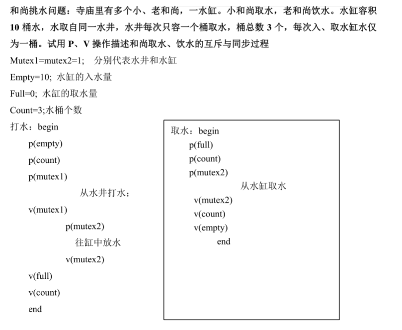
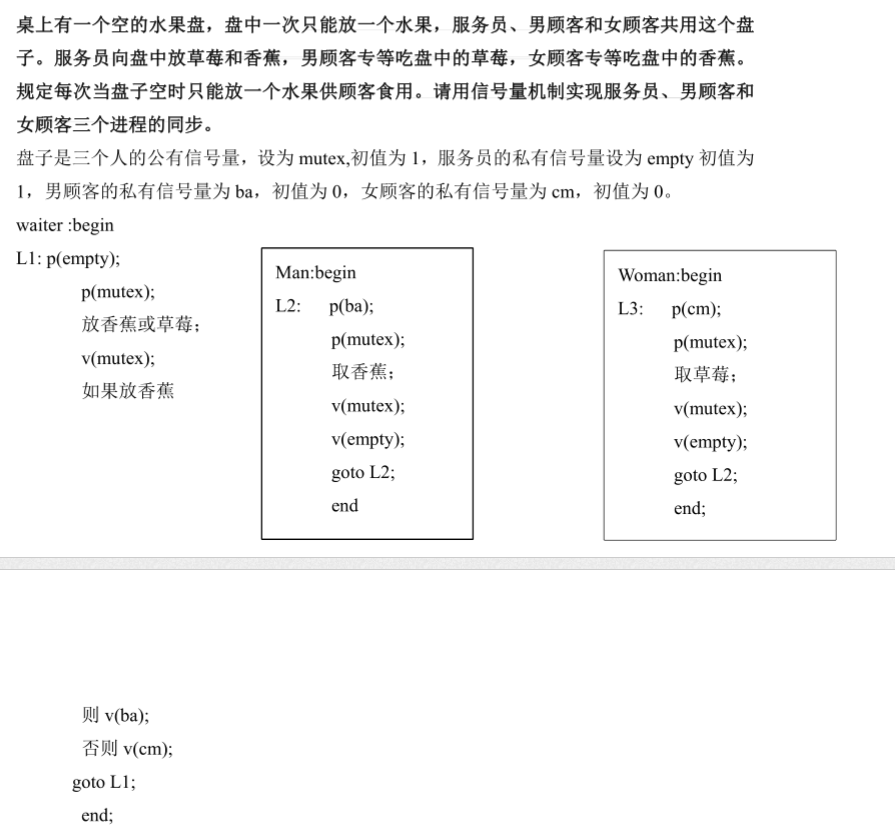
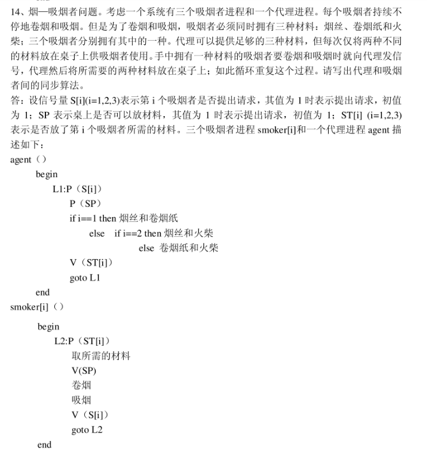

> 普通版：一类进程作为生产者，生产产品，生产的产品放入一个缓冲区，消费者从缓冲区中取出产品，需要保证生产者不可以向满的缓冲区中添加产品，消费者不可以从空的缓冲区中取出产品。同一时刻只可以有一个生产者生产产品或者消费者消费产品。
>
> 升级版可以实现同一个时刻既有生产者生产产品，又有消费者消费产品。但是绝对不可以同一时刻多个生产者生产产品或者多个消费者消费产品。同时使用count记录缓冲区中产品的数量。

- **生产者消费者问题**

  1）生产者进程和消费者进程都以异步方式运行，  但它们之间必须保持同步。

  2）可利用**互斥信号量**$mutex$实现诸进程对缓冲池的互斥使用（不可以同时既向缓冲区中放入数据，又从缓冲区中拿出数据）；利用**资源信号量**empty和full分别表示缓冲池中空缓冲池和满缓冲池的数量。  假定这些生产者和消费者相互等效

  ```c
  /*
  in表示放入数据的地址，out表示取出数据的地址
  buffer[n]：表示大小为n的缓冲池（由多个缓冲区组成） 
  mutex，mutex1，mutex2：互斥型信号量，初值为1
  empty，full：资源型信号量，empty表示空缓冲区的数量，full表示满缓冲区的数量
  item：表示一个数据项
  */
  Int in=0,out=0;  
  Item buffer[n];   
  Semaphore mutex1=1,mutex2 = 1,empty=n,full=0;  
  
  //生产者
  Void producer(){ 
   	do{
  		生产一个产品放入nextp;
          
          /*
           * 进入区
           * 先申请资源信号量，在申请互斥信号量
           * mutex1控制同一个时间段内只能有一个生产者生产产品
           */
  		wait(empty);
  		wait(mutex1);
          
          /*临界区*/
  		buffer[in]=nextp;
  		in=(in+1) % n;
          
          /*退出区*/
  		signal(mutex1);
  		signal(full);
          
          /*对计数器count的互斥访问*/
          wait(mutex);
          count++;
          signal(mutex);
  	}while(TRUE)
  }
  
  //消费者
  Void consumer(){ 
      do{
         /*进入区*/
  	   wait(full);
  	   wait(mutex2);     //消费者对缓冲区的互斥访问
         
         /*临界区*/
  	   nextc =buffer[out];          //只有一份
  	   out =(out+1) mod n;
          
         /*退出区*/
  	   signal(mutex2);
  	   signal(empty);
          
          /*对计数器count的互斥访问*/
          wait(mutex);
          count--;
          signal(mutex);
  	   消费 nextc中的产品;                        
  	}while(TRUE)
  }
  
  
  Void main(){
  	cobegin
  	    proceducer();
   	    consumer();
  	coend
  }
  ```

  **注意：**

  1）每个程序的互斥操作wait（）和signal（）必须成对的出现。

  2）输入进程不可以向满的缓冲池中输入数据，计算进程不可以从空的缓冲池中取数据

  3）在每个程序中的多个wait操作顺序不能颠倒，必须**先执行对资源信号量**的wait操作，**在进行对互斥信号量**的wait操作，否则可能引起进程死锁。

  4）可以使用三个互斥信号量mutex、mutex1、mutex2实现同一时刻既有生产者生产，又有消费者消费。

- **读者—写着问题**

  > 该问题涉计两类进程，第一类进程是读进程Reader，另一类进程是写进程Writer，多个读进程可以同时读一个文件（共享资源），多个写的进程不可以同时写一个文件（对写互斥），并且读的时候不能写，写的时候不能读（对读互斥）。

  1）**问题核心**：保证一个**Writer**进程必须与其他进程**互斥地**访问共享对象的同步问题。

  2）只要求读文件的进程称为“Reader进程”，其它进程则称为“Writer进程”。

  3）允许多个进程同时读一个共享对象，但不允许一个Writer进程和其他Reader进程或Writer进程同时访问共享对象（共享对象并不是临界资源，因为他允许多个进程对其访问）

  ```c
  /*
  记录型信号量解决读者—写者问题
  
  rmutex：读进程对Readcount的互斥
  wmutex：writer对reader和writer的互斥
  readcount：表示正在读的进程数目，只有当readcount=0的时候才需要申请wmutex权限，大于0的时候不需要
  */
  
  semaphore rmutex=1, wmutex =1;
  int readcount =0;
  Void Reader(){
  	do{
  		wait(rmutex);          //防止多个reader进程对readcount的访问
  		if (Readcount==0){    //如果readcount不等于0，表示有进程正在进行读操作，绝对没有写操作
  			wait(wmutex);
  		}
  		Readcount ++;
  		signal(rmutex);
  		…
  		读;
  		…
  		wait(rmutex);
  		Readcount - -;
  		if (Readcount==0){      //只有等于0的时候才需要释放资源，使得写进程可以工作
  			signal(wmutex);
  		}
  		signal(rmutex);
  	}while(TRUE);
  }
  Void writer(){
      do{
          wait(wmutex);      //申请写权限的资源
          写;
          signal(wmutex);
      }while(TRUE);
  }
  
  Void main(){
      cobegin
         reader();  writer();
  	Coend
  }
  ```

  **利用信号量集实现读者写者问题**

  ~~~c
  int RN;
  semaphore L = RN;             //表示读者的数量
  mx = 1；						//对写者进行互斥的访问
  
  void Reader(){
      while(true){
          Swait(L, 1, 1);         //申请一个读者进程
          Swait(mx, 1, 0);       //判断当前是否有写者进程在写，该出相当于一个开关
          
          operation...
              
          Ssignal(L, 1);
      }
  }
  
  void Writer(){
      while(true){
          //此处首先申请一个mx，如果当前系统中无写者进程，则该语句必定执行成功，Reader进程中的
          //Swait（mx, 1, 0）便处于关闭状态，只需要等系统中的读进程执行完毕，(L, RN，0)执行成
          //功，打开开关即可。
          Swait(mx, 1, 1; L, RN, 0);
          
          operation...；
          
          //释放一个写进程
          Ssignal(mx, 1);
      }
  }
  
  void main(){
      cobegin
          Reader();
      	Writer();
      coend;
  }
  ~~~

- **哲学家的进餐问题**

  > 五个哲学家共用一张圆桌，分别坐在周围的五张椅子上，在桌子上有五只碗和五只筷子，他们的生活方式是交替地进行思考和进餐。平时，一个哲学家进行思考，饥饿时便试图取用其左右最靠近他的筷子，只有在他拿到两只筷子时才能进餐。进餐毕，放下筷子继续思考。

  ```c
  /*
  记录型信号量解决问题
  */
  //每一只筷子均为临界资源
  semaphore chopstick[5]={1,1,1,1,1};
  //所有的信号量均被初始化为1，第i位哲学家的活动可描述为：
  do{
  	wait(chopstick[i]);          //拿左手的筷子
  	wait(chopstick[(i+1) mod 5] );      //拿右手的筷子
  	…
  	eat;
  	…
  	signal(chopstick[i]);    //放左手
  	signal(chopstick[(i +1)mod 5]);       //放右手
  	…
  	think;
  }while(TRUE);
  ```

  > 存在的问题：假如五位哲学家同时饥饿而各自拿起左边的筷子时，就会使五个信号量chopstick均为0，当他们再试图去拿右边的筷子时，都将因无筷子可拿而无限等待。进入死锁状态。

  **解决办法：**

  **1）**至多只允许有四位哲学家同时去拿左边的筷子，最终能保证至少有一位哲学家能够进餐，并在用毕后释放出他用过的两只筷子，从而使更多的哲学家能够进餐。

  ```c
  semaphore chopstick[5]={1，1，1，1，1};
  semaphore count=4;
  void philosopher(int i)
  {
      while(true)
      {
          think();
          wait(count); //请求进入房间进餐
          wait(chopstick[i]); //请求左手边的筷子
          wait(chopstick[(i+1)%5]); //请求右手边的筷子
          eat();
          signal(chopstick[(i+1)%5]); //释放右手边的筷子
          signal(chopstick[i]); //释放左手边的筷子
          signal(count); //退出房间释放信号量
      }
  }
  ```

  **2）**仅当哲学家的左右两只筷子均可用时，才允许他拿起筷子进餐。

  ```c
  /*
  使用AND型信号量解决，本质当同时拥有两只筷子的时候才允许拿起筷子进餐
  */
  semaphore chopstick[5]={1,1,1,1,1};
  Philosopher i
  do{
  	think;
  	Swait(chopstick[(i+1)mod 5],chopstick[i ]);     //同时分配两只筷子
  	eat;
  	Ssignal(chopstick[(i+1)mod 5], chopstick[i ] );     //同时放下两只筷子  
  }while(TRUE)
  ```

  **3）**规定奇数号哲学家先拿他左边的筷子，然后再去拿右边的筷子；偶数号哲学家则相反。

  ```c
  semaphore chopstick[5]={1,1,1,1,1};
  //第i 位哲学家的活动可描述为：
  do{
      //奇数位哲学家先拿左手的筷子
  	if  i mod 2=1 {
  		wait(chopstick[ i ]);
  		wait(chopstick[ ( i +1) mod 5] )
  	}
      //偶数位哲学家先拿右手边的筷子
  	else
  	{
  		wait(chopstick[ ( i +1) mod 5] );
  		wait(chopstick[ i ])
  	}
  	eat;
  	signal(chopstick[ i ]);
  	signal(chopstick[(i +1)mod 5]);
  	…
  	think;
  }while(TRUE)
  ```

- **面包店问题（生产者消费者模型）**

- **南北桥问题（读者—写者模型）**

```c
semaphore mutex = 1;// 作为桥的互斥访问信号量
semaphore smutex = 1;// 作为southcount的互斥访问信号量
semaphore nmutex = 1;// 作为northcount的互斥访问信号量
int southcount = 0;// 记录南方向的车辆的数量
int northcount = 0;// 记录北方向的车辆的数量
void south()
{
	while(true)
	{
		wait(smutex);
		if(southcount == 0)
			wait(mutex);
		southcount++;
		signal(smutex);
		// 南方车辆通过
		wait(smutex);
		southcount--;
		if(southcount == 0)
			signal(mutex);
		signal(smutex);
	}
}
void north()
{
	while(true)
	{
		wait(nmutex);
		if(northcount == 0)
			wait(mutex);
		northcount++;
		signal(nmutex);
		// 北方车辆通过
		wait(nmutex);
		northcount--;
		if(northcount == 0)
			signal(mutex);
		signal(nmutex);
	}
}
```

**和尚打水问题（生产者消费者模型）**



**取水果问题（生产者消费者问题）**



**吸烟者问题（生产者消费者问题）**



**银行叫号取号的问题（设计巧妙）**

> 某银行有人民币储蓄业务，由n个柜员负责，有1台取号机。每个顾客进入银行后先取一个号，若有人取号则需等他人取完后才能取，取到号后等待叫号，当一个柜员人员空闲下来，就叫下一个号。试用P，V操作正确编写柜台人员和顾客进程的程序。

```c
//mutex1顾客互斥使用取号机取号
//mutex2柜员叫号时候互斥/访问
//counter表示等待队列中的顾客人数
Semaphore： mutex1=1， mutex2=1，counter=0；

Cobegin{
    Customer（）
    {
    	//互斥的使用取号机
        wait(mutex1);
        取号码，进入队列；
        signal(mutex1);
        signal(counter);
    }
    Server（）
    {
        wait(counter);
        //多个营业员互斥的叫号，防止多个人同时叫一个号
        wait(mutex2);
        从队列中取下一个号码；
        signal(mutex2);
        为该号码持有者服务；
    }
}Coend
```

**还是银行取号问题（设计巧妙）**

> 某银行提供1个服务窗口和10个供顾客等待的座位。顾客到达银行时，若有空座位，则到取号机上领取一个号，等待叫号。取号机每次仅允许一位顾客使用，当营业员空闲时，通过叫号选取一位顾客，并为其服务。顾客和营业员的活动过程描述如下： 

```c
// mutex表示互斥使用取号机
// empty表示空座位的数量
// full表示已占座位的数量
// service表示柜员是否空闲
semaphore mutex=1, empty=10, full=0, service=0；  

cobegin
{
	process顾客i
	{
		//先看看有没有空座位，有的话取号
		wait(empty)；
		wait(mutex)；
		从取号机获得一个号；
		signal(mutex)；
		signal(full)；
		
		//多个人需要共享营业员
		wait(service)；    //等待叫号
		获得服务；
	}
	process营业员
	{
		while(TRUE)
		{
			//先看看座位上有没有人，如果有的话叫号
			wait(full)；
			signal(empty)；
			signal(service)；    //叫号
			为顾客服务；
		}
	}
}
coend
```


