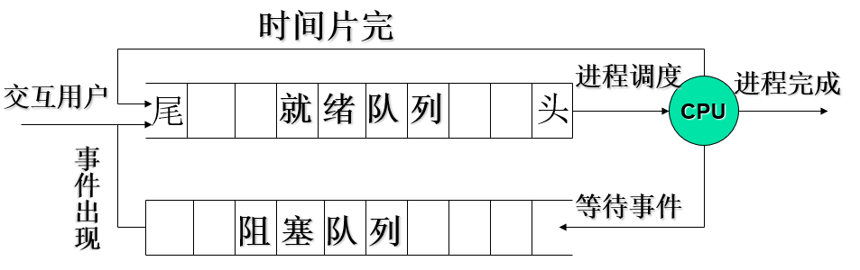

## 三、处理机的调度与死锁

### 3.1处理机调度的层次和调度算法的目标

#### 3.1.1 处理机调度的层次

> 一个批处理型作业，从进入系统并驻留在外存的后备队列上开始，直至作业运行完毕，可能要经历下述三级调度。

##### 1.高级调度

​	又称为作业调度、长程调度$（Long-TermScheduling）或接纳调度（AdmissionScheduling）$，用于决定把**外存上处于后备队列**中的**哪些作业调入内存**，并为它们创建进程、分配必要的资源，然后将新创建的进程排在就绪队列上，准备执行。**主要用于多道批处理操作系统中，在分时和实时操作系统中不设置**。

一般需要考虑以下两个问题：

* **接纳多少作业**——每次接纳多少作业进入内存，即允许多少个作业同时在内存中运行---多道程序。其确定应根据系统的规模、运行速度等情况综合考虑。
* **接纳哪些作业**——应接纳哪些作业从外存调入内存，取决于所采用的调度算法。如先来先服务，短作业优先等

##### 2.低级调度

​	通常也称为进程调度或短程调度$（Short-TermScheduling）$，用来决定就绪队列中的哪个**进程**应获得处理机，然后再由分派程序把处理机分配给该进程。为最基本的一种调度，**三种OS中都设置。**

进程调度可采用下述两种调度方式：

*  **非抢占方式：**

  一旦把处理机分配给某进程后，便让该进程一直执行，直至该进程完成或发生某事件而被阻塞时，才把处理机分配给其他进程，决不允许进程抢占已分配出去的处理机。

  可能引起进程调度的因素：

  * 正在执行的进程运行完毕或因发生某种事件而无法继续执行
  * 正在执行的进程提出了I/O请求暂停执行
  * 在进程的通信和同步的过程中执行了原语操作

* **抢占方式：**

  允许调度程序根据某种原则，去暂停某个正在执行的进程，将处理机重新分配给另一进程。

  抢占的原则：

  * 优先权原则：优先权高的可以抢占优先级低的进程的处理机。

  * 短作业（进程）优先原则：短作业（进程）可以抢占长作业（进程）的处理机。

  * 时间片原则：各进程按时间片运行，一个时间片用完时，停止该进程执行重新进行调度。

##### 3.中级调度

​	又称中程调度$（Medium-TermScheduling）$。为了**提高内存利用率和系统吞吐量**。使那些暂时不能运行的进程不再占用宝贵的内存资源，而将它们调之外存去等待，把此时的进程状态称为就绪驻外存状态或挂起状态。当这些进程重又具备运行条件、且内存又稍有空闲时，由中级调度来决定把外存上的哪些又具备运行条件的就绪进程，重新调入内存，并修改其状态为就绪状态，挂在就绪队列上等待进程调度。	

##### 4.调度队列模型

1. 仅有进程调度：在分时系统中就绪进程组织成**FIFO**队列形式，按**时间片轮转**方式运行。

   如下图：

   

2. 具有高级调度和低级调度：在批处理系统中，不仅需要进程调度，而且还需要作业调度，由作业调度按一定的调度算法，从外存的后备队列中选择一批作业调入内存，并为它们建立进程，送入就绪队列（一般为**优先权队列**），然后才由进程调度算法按照一定的进程调度算法，选择一个进程，把处理机分配给该进程。

   如下图：

   

   与第一个模型的差别：

   1）就绪队列最常采用优先权队列

   2）可以设置多个阻塞队列

3. 同时具有三级调度：当在OS中引入中级调度后，可以把进程的就绪状态分为内存就绪和外存就绪。也可以把阻塞状态分为内存阻塞和外存阻塞两种状态。在调出操作的作用下，可使进程状态由内存就绪转变为外存就绪，由内存阻塞转变为外存阻塞；在中级调度的作用下，又可使外存就绪转变为内存就绪。

   如下图：

   

#### 3.1.2处理机调度的算法目标

##### 1.处理机调度算法的共同目标

1）资源利用率；2）公平性；3）平衡性；4）策略强制执行

##### 2.批处理系统（一般都与作业的概念相关）

###### 1.周转时间

**1）注意四个概念：**

* 周转时间：从作业提交到外存（系统）开始，到作业完成为止，包括四个部分：1）作业在外存上的后备队列的等待时间；2）作业在内存中就绪队列的等待时间；3）作业在CPU上的执行时间；4）作业发生阻塞后的等待时间
* 平均周转时间：多个作业的周转时间相加取平均值，体现了用户整体对服务的满意程度，越小越好
* 带权周转时间：作业的周转时间/作业的运行时间（作业占领处理机的时间）
* 平均带权周转时间：多个作业的带权周转时间相加取平均值，体现了机器的整体资源利用率，也是越小越好

**计算：**将如下图的信息填补完整

| 作业 | 提交时间 | 运行时间 | 开始时间 | 完成时间 | 周转时间 | 平均周转时间 |
| ---- | -------- | -------- | -------- | -------- | -------- | ------------ |
| 1    |          |          |          |          |          |              |
| 2    |          |          |          |          |          |              |
| 3    |          |          |          |          |          |              |

###### 2.系统吞吐量高

​	单位时间内系统所完成的作业数

###### 3.处理机利用率好

##### 3.分时系统

1）响应时间：是指用户从键盘提交一个请求开始，直到屏幕上显示出处理结果为止的一段时间间隔。主要包括三部分：1）请求信息从键盘输入开始，到传送到处理机的时间；2）处理机对信息进行处理的时间；3）将所形成的相应信息回送到终端显示器的时间。

2）均衡性

##### 4.实时系统

1）截止时间：某任务必须开始执行的最迟时间。

2）可预测性

### 3.2作业与作业调度

#### 3.2.1概述

​	在批处理系统中，因作业进入系统后先驻留在外存，故需要有作业调度。在分时系统中为做到及时响应，作业被直接送入内存，故不需作业调度。在实时系统中，通常也不需作业调度。

1）通常需要完成两件事情：（1）接纳多少个作业；（2）接纳哪些作业

2）作业调度算法的概念：在OS中调度的实质是一种资源分配，因而调度算法是指：根据系统的资源分配策略所规定的资源分配算法。

3）常见的调度算法：1）先来先服务调度算法（$FCFS$）；2）短作业（进程）优先算法（SJ（P）F）；3）高优先权调度算法和高响应比优先调度算法

#### 3.2.2调度算法

##### 1.先来先服务（$FCFS$）

1）是一种最简单的调度算法，既可用于**作业调度**，也可用于**进程调度**。

2）当在**作业调度**中采用$FCFS$算法时，每次调度都是从**后备作业队列**中，选择一个或多个最先进入该队列的作业，将它们**调入内存**，为它们分配资源、创建进程，然后放入就绪队列。

3）在**进程调度**采用$FCFS$算法时，则每次调度是从**就绪队列**中选择一个最先进入该队列的进程，为之**分配处理机**，使之运行。

4）$FCFS$算法比较有利于长作业（进程），而不利于短作业（进程）。有利于CPU繁忙性的作业，不利于I/O繁忙性作业

5）CPU繁忙型作业**带权周转时间接近1，I/O繁忙性作业带权周转时间非常大**。

##### 2.短作业（进程）优先调度算法（SJ(P)F）

1）指对短作业或短进程优先调度的算法。它们可以分别用于**作业调度和进程调度**。

2）**短作业优先（$SJF$）的调度算法**，是从后备队列中选择一个或若干个**估计运行时间最短的作业**，将它们调入内存运行。

3）**短进程优先（$SPF$）调度算法**，是从就绪队列中选出一**估计运行时间最短的进程**，将处理机分配给它，使它立即执行并一直执行到完成，或发生某事件而被阻塞放弃处理机时，再重新调度。

**例题：**

**分析：**不论是平均周转时间还是平均带权周转时间，都较$FCFS$调度算法有较明显的改善，尤其是对短作业D。而平均带权周转时间从2.8降到了2.1。这说明$SJF$调度算法能有效的降低作业的平均等待事件，提高系统吞吐量。

4）评价：

优点：有效降低作业的平均等待时间，提高系统吞吐量。

缺点：（1）对长作业不利。（2）该算法**完全未考虑作业的紧迫程度（$FCFS$也未考虑）**，因而不能保证紧迫性作业（进程）会被及时处理。（3）由于作业（进程）的长短含主观因素，不一定能真正做到短作业优先。**因为长短是估计的**

##### 3.高优先权调度算法和高响应比优先调度算法

**高优先权调度算法：**

1. 提出的原因：考虑到了作业的**紧迫程度**，可以适用于多种操作系统。

2. 分类：1）非抢占式优先权算法；2）抢占式优先权调度算法；区别见上文。

3. 优先权的类型：

   1）静态优先权：在创建进程时确定的，在进程的整个运行期间保持不变。一般利用某一范围的一个整数来表示，又称为**优先数。**

   2）动态优先权：在创建进程时所赋予的优先权可以随进程的推进或随其等待时间的增加而改变。

4. 确定优先权类型的依据：

   1）进程的类型：一般来说系统进程高于用户进程

   2）进程对资源的需求：如进程的估计时间及内存需要量的多少，对要求少的进程赋予较高优先权。

   3）用户要求：由用户进程的紧迫程度及用户所付费用的多少来确定优先权的。

**高响应比优先调度算法：**

1. 提出的原因：弥补短作业优先算法在处理过程中长作业的执行得不到保证的问题

2. 解决方式：动态优先权：优先权 = (等待时间+要求服务时间)/要求服务时间。

   或者：$Rp(响应比)$=响应时间/要求服务时间；响应比和上方的优先权等同。

3. 分析：

   1）如作业等待时间相同，则要求服务的时间愈短优先权愈高，所以该算法利于短作业。

   2）当要求服务的时间相同，作业优先权的高低决定于其等待时间的长短，所以是先来先服务。

   3）对于长作业，作业的优先级可以随等待时间的增加而提高，当其**等待时间足够长也可获得处理机**。

   4）优点：兼顾长作业

   ​      缺点：增加系统计算优先权的开销

### 3.3进程调度

#### 1.两种进程调度算法

**1. 时间片轮转发**

1. 执行过程：系统将所有的就绪进程按先来先服务的原则排成一个队列，每次调度时，把CPU分配给首进程，并令其执行一个时间片。当执行的时间片用完时，停止该进程的执行并将其送往就绪队列的末尾。或者在指定的时间片范围之内该进程执行完毕，直接结束。
2. 评价：简单，但是为考虑进程的紧迫程度。

**2. 多级反馈队列调度算法**（比较牛逼，当前Unix系统使用）

1. 执行过程：

   1）设置**多个队列**并为各个队列**赋予不同的优先级**（每个队列内部进程优先级相同，按照先来先服务的原则进行）。第一个最高，依次降低。各个队列中进程执行时间片的大小设置为：**优先权越高，时间片越短**。（注意：优先权高，执行时间再长，太不公平了）

   2）当一个新进程进入内存后，首先将它放入第一个队列的末尾，按$FCFS$原则排队等待调度。当轮到该进程执行时，如它能在该时间片内完成，便可准备撤离系统；如果它在一个时间片结束时尚未完成，调度程序便将该进程转入第二队列的末尾，在同样地按$FCFS$原则等待调度执行；如果它在第二队列中运行一个时间片后仍未完成，再依次将它放入第三队列，……如此下去，当一个长作业（进程）从第一队列依次将到第n队列后，在第n队列中便采取按时间片轮转的方式运行。

   3）仅当第一队列空闲时，调度程序才调度第二队列中的进程运行，仅当第1~(i-1)队列均空时，才会调度第i队列中的进程运行。

   **特别注意：**该调度算法是抢占式的，假设当在第i个队列为某个进程服务时，突然出现了一个优先级高的进程，那么新进程将立即占领处理机，原先的进程被放在原先队列的末尾

2. 分析：

   1）终端型作业用户。大多属于较小的交互性作业，只要能使作业在第一队列的时间片内完成，便可令用户满意。

   2）短批处理作业用户。周转时间仍然较短，至多在第二到三队列即可完成。

   3）长批处理作业用户。将依次在1~n级队列中轮转执行，不必担心作业长期得不到处理。

### 3.4 实时调度

### 3.5 死锁的概述

### 3.6 预防死锁

### 3.7 避免死锁

### 3.8 死锁的检测与解除 