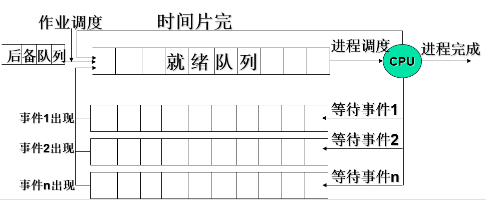
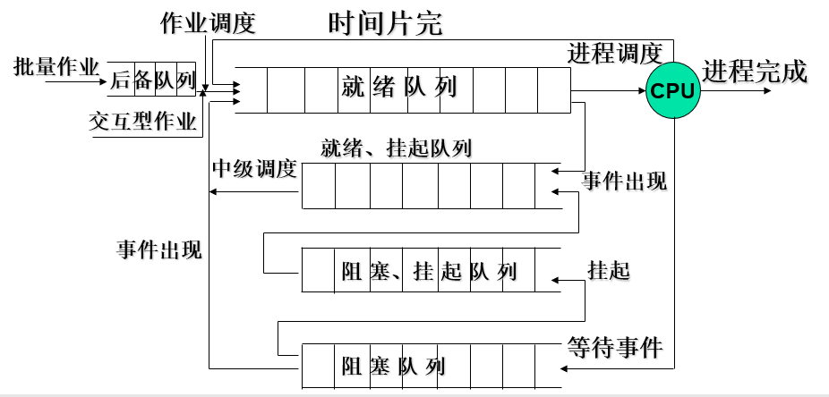
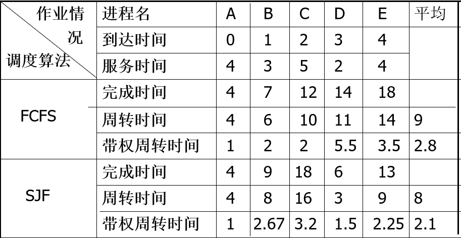
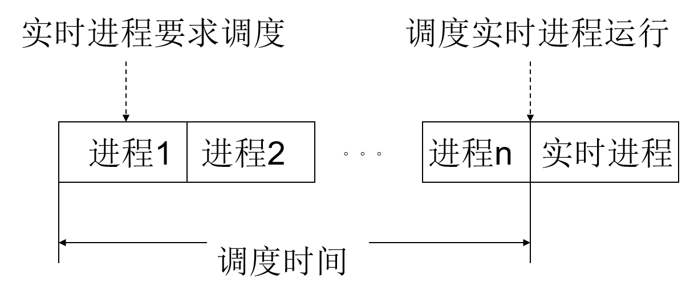
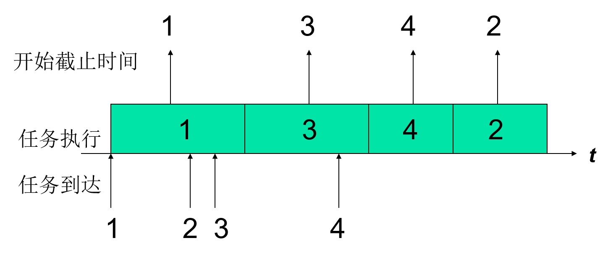
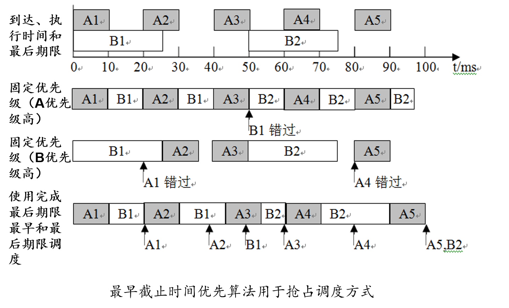
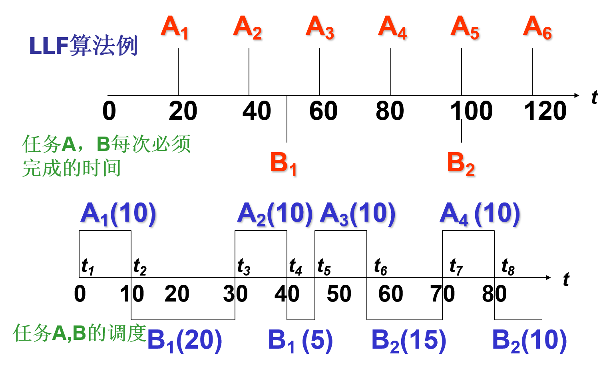

## 三、处理机的调度与死锁

### 3.1处理机调度的层次和调度算法的目标

#### 3.1.1 处理机调度的层次

> 一个批处理型作业，从进入系统并驻留在外存的后备队列上开始，直至作业运行完毕，可能要经历下述三级调度。

##### 1.高级调度

---

​	又称为作业调度、长程调度$（Long-TermScheduling）或接纳调度（AdmissionScheduling）$，用于决定把**外存上处于后备队列**中的**哪些作业调入内存**，并为它们创建进程、分配必要的资源，然后将新创建的进程排在就绪队列上，准备执行。**主要用于多道批处理操作系统中，在分时和实时操作系统中不设置**。

一般需要考虑以下两个问题：

* **接纳多少作业**——每次接纳多少作业进入内存，即允许多少个作业同时在内存中运行---多道程序。其确定应根据系统的规模、运行速度等情况综合考虑。
* **接纳哪些作业**——应接纳哪些作业从外存调入内存，取决于所采用的调度算法。如先来先服务，短作业优先等

##### 2.低级调度

---

​	通常也称为进程调度或短程调度$（Short-TermScheduling）$，用来决定就绪队列中的哪个**进程**应获得处理机，然后再由分派程序把处理机分配给该进程。为最基本的一种调度，**三种OS中都设置。**

##### 3.中级调度

---

​	又称中程调度$（Medium-TermScheduling）$。为了**提高内存利用率和系统吞吐量**。使那些暂时不能运行的进程不再占用宝贵的内存资源，而将它们调之外存去等待，把此时的进程状态称为就绪驻外存状态或挂起状态。当这些进程重又具备运行条件、且内存又稍有空闲时，由中级调度来决定把外存上的哪些又具备运行条件的就绪进程，重新调入内存，并修改其状态为就绪状态，挂在就绪队列上等待进程调度。	

##### 4.调度队列模型

---

1. 仅有进程调度：在分时系统中就绪进程组织成**FIFO**队列形式，按**时间片轮转**方式运行。

   如下图：

   

2. 具有高级调度和低级调度：在批处理系统中，不仅需要进程调度，而且还需要作业调度，由作业调度按一定的调度算法，从外存的后备队列中选择一批作业调入内存，并为它们建立进程，送入就绪队列（一般为**优先权队列**），然后才由进程调度算法按照一定的进程调度算法，选择一个进程，把处理机分配给该进程。

   如下图：

   

   与第一个模型的差别：

   1）就绪队列最常采用优先权队列

   2）可以设置多个阻塞队列

3. 同时具有三级调度：当在OS中引入中级调度后，可以把进程的就绪状态分为内存就绪和外存就绪。也可以把阻塞状态分为内存阻塞和外存阻塞两种状态。在调出操作的作用下，可使进程状态由内存就绪转变为外存就绪，由内存阻塞转变为外存阻塞；在中级调度的作用下，又可使外存就绪转变为内存就绪。

   如下图：

   

#### 3.1.2处理机调度的算法目标

##### 1.处理机调度算法的共同目标

1）资源利用率；2）公平性；3）平衡性；4）策略强制执行

##### 2.批处理系统（一般都与作业的概念相关）

###### 1.周转时间

**1）注意四个概念：**

* 周转时间：从作业提交到外存（系统）开始，到作业完成为止，包括四个部分：1）作业在外存上的后备队列的等待时间；2）作业在内存中就绪队列的等待时间；3）作业在CPU上的执行时间；4）作业发生阻塞后的等待时间
* 平均周转时间：多个作业的周转时间相加取平均值，体现了用户整体对服务的满意程度，越小越好
* 带权周转时间：作业的周转时间/作业的运行时间（作业占领处理机的时间）
* 平均带权周转时间：多个作业的带权周转时间相加取平均值，体现了机器的整体资源利用率，也是越小越好

**计算：**将如下图的信息填补完整

| 作业 | 提交时间 | 运行时间 | 开始时间 | 完成时间 | 周转时间 | 平均周转时间 |
| ---- | -------- | -------- | -------- | -------- | -------- | ------------ |
| 1    |          |          |          |          |          |              |
| 2    |          |          |          |          |          |              |
| 3    |          |          |          |          |          |              |

###### 2.系统吞吐量高

​	单位时间内系统所完成的作业数

###### 3.处理机利用率好

##### 3.分时系统

1）响应时间：是指用户从键盘提交一个请求开始，直到屏幕上显示出处理结果为止的一段时间间隔。主要包括三部分：1）请求信息从键盘输入开始，到传送到处理机的时间；2）处理机对信息进行处理的时间；3）将所形成的相应信息回送到终端显示器的时间。

2）均衡性

##### 4.实时系统

1）截止时间：某任务必须开始执行的最迟时间。

2）可预测性

### 3.2作业与作业调度

---

#### 3.2.1概述

---

​	在**批处理系统中**，因作业进入系统后先驻留在外存，故需要有作业调度。在分时系统中为做到及时响应，作业被直接送入内存，故不需作业调度。在实时系统中，通常也不需作业调度。

​	注意：作业调度没有抢占和非抢占之分，抢占是抢占处理机，而作业调度只是从后备队列中选取作业进入就绪队列

**1. 主要任务：**

---

1. 接纳多少个作业；
2. 接纳哪些作业

**2. 常见的高级调度算法：**

---

1. 先来先服务调度算法（FCFS）
2. 短作业优先调度算法（SJF）
3. 高优先权调度算法
4. 高响应比优先调度算法

#### 3.2.2调度算法

---

**1. 先来先服务（FCFS）**

1. 是一种最简单的调度算法，既可用于**作业调度**，也可用于**进程调度**。

2. 当在**作业调度**中采用FCFS算法时，每次调度都是从**后备作业队列**中，选择一个或多个最先进入该队列的作业，将它们**调入内存**，为它们分配资源、创建进程，然后放入就绪队列。

3. 在**进程调度**采用FCFS算法时，则每次调度是从**就绪队列**中选择一个最先进入该队列的进程，为之**分配处理机**，使之运行。

4. FCFS算法比较有利于长作业（进程），而不利于短作业（进程）。有利于CPU繁忙性的作业，不利于I/O繁忙性作业

5. CPU繁忙型作业**带权周转时间接近1，I/O繁忙性作业带权周转时间非常大**。

**2. 短作业优先调度算法（SJF）**

1. 指对短作业或短进程优先调度的算法。它们可以分别用于**作业调度和进程调度**。

2. **短作业优先（SJF）的调度算法**，是从后备队列中选择一个或若干个**估计运行时间最短的作业**，将它们调入内存运行。

3. **短进程优先（SPF）调度算法**，是从就绪队列中选出一**估计运行时间最短的进程**，将处理机分配给它，使它立即执行并一直执行到完成，或发生某事件而被阻塞放弃处理机时，再重新调度。

**例题：**

**分析：**不论是平均周转时间还是平均带权周转时间，都较FCFS调度算法有较明显的改善，尤其是对短作业。而平均带权周转时间从2.8降到了2.1。这说明SJF调度算法能有效的降低作业的平均等待事件，提高系统吞吐量。

4）评价：

优点：有效降低作业的平均等待时间，提高系统吞吐量。

缺点：（1）对长作业不利。（2）该算法**完全未考虑作业的紧迫程度（FCFS也未考虑）**，因而不能保证紧迫性作业（进程）会被及时处理。（3）由于作业（进程）的长短含主观因素，不一定能真正做到短作业优先。**因为长短是估计的**

**3. 高优先权调度算法：**

1. 提出的原因：考虑到了作业的**紧迫程度**，可以适用于多种操作系统。

2. 分类：1）非抢占式优先权算法；2）抢占式优先权调度算法；区别见上文。

3. 优先权的类型：

   1）静态优先权：在创建进程时确定的，在进程的整个运行期间保持不变。一般利用某一范围的一个整数来表示，又称为**优先数。**

   2）动态优先权：在创建进程时所赋予的优先权可以随进程的推进或随其等待时间的增加而改变。

4. 确定优先权类型的依据：

   1）进程的类型：一般来说系统进程高于用户进程

   2）进程对资源的需求：如进程的估计时间及内存需要量的多少，对要求少的进程赋予较高优先权。

   3）用户要求：由用户进程的紧迫程度及用户所付费用的多少来确定优先权的。

**4. 高响应比优先调度算法（高级调度算法中比较好的算法）：**

1. 提出的原因：弥补短作业优先算法在处理过程中长作业的执行得不到保证的问题

2. 解决方式：动态优先权：优先权 = (等待时间+要求服务时间)/要求服务时间。

   或者：Rp(响应比)=响应时间/要求服务时间；响应比和上方的优先权等同。

3. 分析：

   1）如作业等待时间相同，则要求服务的时间愈短优先权愈高，所以该算法利于短作业。

   2）当要求服务的时间相同，作业优先权的高低决定于其等待时间的长短，所以是先来先服务。

   3）对于长作业，作业的优先级可以随等待时间的增加而提高，当其**等待时间足够长也可获得处理机**。

   4）优点：兼顾长作业

   ​      缺点：增加系统计算优先权的开销

### 3.3进程调度

---

#### 3.3.1 概述

用来决定就绪队列中的哪个进程应获得处理机，然后再由分派程序把处理机分配给该进程。为最基本的一种调度，三种OS中都有。

**主要任务：**

---

1. 保存处理机的现场信息
2. 通过调度算法选取进程
3. 把处理机分配给进程

**进程调度可采用的两种方式：**

---

**1. 非抢占方式：**

  一旦把处理机分配给某进程后，便让该进程一直执行，直至该进程完成或发生某事件而被阻塞时，才把处理机分配给其他进程，决不允许进程抢占已分配出去的处理机。

  可能引起进程调度的因素：

- 正在执行的进程运行完毕或因发生某种事件而无法继续执行
- 正在执行的进程提出了I/O请求暂停执行
- 在进程的通信和同步的过程中执行了原语操作

**2. 抢占方式：**

允许调度程序根据某种原则，去暂停某个正在执行的进程，将处理机重新分配给另一进程。

抢占的原则：

- 优先权原则：优先权高的可以抢占优先级低的进程的处理机。
- 短作业（进程）优先原则：短作业（进程）可以抢占长作业（进程）的处理机。
- 时间片原则：各进程按时间片运行，一个时间片用完时，停止该进程执行重新进行调度。如果在当前的时间片内该进程运行完毕，一般并不会立即引起进程的调度，而是等到时钟到了才进行。

#### 3.3.2 两种进程调度算法

---

**1. 先来先服务调度算法（基于抢占和非抢占方式两种）**

对于先来先服务算法抢占式和非抢占式效果一样

**2. 短作业优先调度算法（基于抢占和非抢占）**

非抢占方式：每次进程执行完之后，进行调度总是选择需要服务时间最短的进程占据CPU。

抢占方式：每次时间片到达之后，调度程序重新进行调度，选择所需服务时间最短的进程占据CPU

**3. 时间片轮转法**

1. 执行过程：系统将所有的就绪进程按先来先服务的原则排成一个队列，每次调度时，把CPU分配给首进程，并令其执行一个时间片。当执行的时间片用完时，停止该进程的执行并将其送往就绪队列的末尾。或者在指定的时间片范围之内该进程执行完毕，直接结束。
2. 评价：简单，但是为考虑进程的紧迫程度。

**4. 多级反馈队列调度算法**（比较牛逼，当前Unix系统使用）

1. 执行过程：

   1）设置**多个队列**并为各个队列**赋予不同的优先级**（每个队列内部进程优先级相同，按照先来先服务的原则进行）。第一个最高，依次降低。各个队列中进程执行时间片的大小设置为：**优先权越高，时间片越短**。（注意：优先权高，执行时间再长，太不公平了）

   2）当一个新进程进入内存后，首先将它放入第一个队列的末尾，按FCFS原则排队等待调度。当轮到该进程执行时，如它能在该时间片内完成，便可准备撤离系统；如果它在一个时间片结束时尚未完成，调度程序便将该进程转入第二队列的末尾，在同样地按FCFS原则等待调度执行；如果它在第二队列中运行一个时间片后仍未完成，再依次将它放入第三队列，……如此下去，当一个长作业（进程）从第一队列依次将到第n队列后，在第n队列中便采取按时间片轮转的方式运行。

   3）仅当第一队列空闲时，调度程序才调度第二队列中的进程运行，仅当第1~(i-1)队列均空时，才会调度第i队列中的进程运行。

   **特别注意：**该调度算法是抢占式的，假设当在第i个队列为某个进程服务时，突然出现了一个优先级高的进程，那么新进程将立即占领处理机，原先的进程被放在原先队列的末尾

2. 分析：

   1）终端型作业用户。大多属于较小的交互性作业，只要能使作业在第一队列的时间片内完成，便可令用户满意。

   2）短批处理作业用户。周转时间仍然较短，至多在第二到三队列即可完成。

   3）长批处理作业用户。将依次在1~n级队列中轮转执行，不必担心作业长期得不到处理。

### 3.4 实时调度

---

#### 3.4.1 概述

---

**1. 实时系统中包含的两种任务：**

---

1. 硬实时任务：要求严格，必须满足最后期限的限制，否则将带来严重的后果。

2. 软实时任务：尽可能的满足最后时间限制，但是万一满足不了也可以接受，出来的结果仍然是有意义的

**2. 实时调度算法的分类：**

---

**非抢占式：**

1. 非抢占式轮转调度算法：常用于工业生产的群控系统中,要求不太严格。类似于时间片轮转法，不同的地方是：**时间片轮转法分配有固定的时间，该处是只要进程占有处理机之后，便直到该进程运行完毕，效率低**

   **图例：**

   

   注：实时进程到达之后并不能立即执行，需要等待

2. 非抢占式优先调度算法：非抢占式优先调度算法：要求较为严格,根据任务的优先级安排等待位置，**当优先级较高的实时任务到达之后，直接将其插入就绪队列的队首，等待当前任务不占用处理机的时候执行**。可用于有一定要求的实时控制系统中。

   **图例：**

   

   注：高优先级的实时任务到达之后立即放到就绪队列的首部

**抢占式：**

1. 基于时钟中断的抢占式优先级调度算法：某高优先级任务到达后并不立即抢占，而**等下一个时钟中断**时抢占。

2. 立即抢占的优先级调度算法：一旦出现外部中断，**只要当前任务未处于临界区**（不管怎么样临界区不能中断执行），就立即抢占处理机。

#### 3.4.2实现实时调度的基本条件

1. 提供必要的信息

   1）就绪时间：该任务成为就绪状态的时间。

   2）**开始截止时间、完成截止时间**：只需知道一个。即完成该任务的最迟的开始时间和截止时间

   3）处理时间：从开始执行到完成所需时间。

   4）资源要求：任务执行时所需的一组资源。（资源少的，优先级相对较高）

   5）优先级：根据任务性质赋予不同优先级。

2. 系统处理能力强

   假如系统中有M个周期性的硬实时任务，处理时间为$C_i$，周期时间表示为$P_i$ ,可用下述限制条件判断系统是否可以进行调度。

   $$\sum_{i=1}^{n} \frac{C_i}{P_i} <= N$$（N表示处理机数，该式成立，系统才有能力进行调度）

   **解决方法:**

   1）仍然采用单处理机，但是增强处理机的处理能力

   2）增加处理机的核数。

3. 采用抢占式调度机制

   即优先权高的进程到达时，将当前进程挂起，执行高优先权的进程

4. 具有快速切换机制

   即具备下述两种能力：

   1）对中断的快速响应能力：对紧迫的外部事件请求中断能及时响应

   2）快速的任务分派能力：减少任务切换时的时间开销

#### 3.4.3 最早截止时间优先EDF​算法

​	**根据任务的截止时间来确定任务的优先级。截止时间越早，其优先级越高。**该算法要求在系统中保持一个实时任务就绪队列，该队列按各任务截止时间的早晚排序，调度程序在选择任务时总是选择就绪队列中的第一个任务，为之分配处理机，使之投入运行。EDF算法既可以用于抢占式调度，也可用于非抢占式调度。

1. 非抢占式调度方式用于非周期实时任务：基于的是**开始截止时间**最早

   **图例：**

   

   注：任务到达时间的先后顺序是1、2、3、4，开始截止时间是1，3，4，2，所以任务按开始截止时间的先后顺序进行调度执行

2. 抢占式调度方式用于周期实时任务：基于的是**完成截止时间**最早

   **描述：**两个周期性任务，任务A的周期时间为20ms，每个周期的处理时间为10ms；任务B的周期时间为50ms，每个周期的处理时间为25ms

   **图例：**

   

   **注：**在使用固定的优先级的情况下，会有任务错过完成截止时间。

#### 3.4.4 最低松弛度优先LLF算法

1. 概述：该算法是根据任务紧急（或松弛）的程度，来确定任务的先级。**任务的紧急程度越高，为之赋予的优先级就越高。**该算法主要用于抢占的调度方式中

2. 任务的紧急（或松弛）的程度：**必须完成时间-其本身的运行时间-当前时间**

3. **问题描述：**假如在一个实时系统中，有两个周期型实时任务A,B，任务A要求每20ms执行一次，执行时间为10ms；任务B要求每50ms执行一次，执行时间为25ms；由此可得知A，B任务每次必须完成的时间分别为A1、A2、A3…和B1、B2、B3…

   **图例：**

   

### 3.5 死锁的概述

### 3.6 预防死锁

### 3.7 避免死锁

### 3.8 死锁的检测与解除 