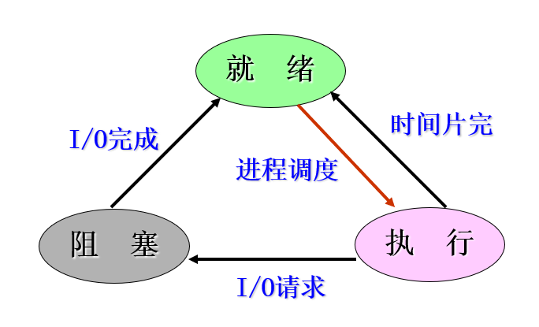
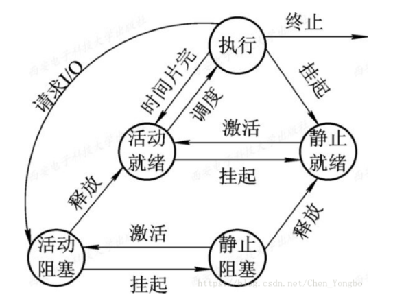
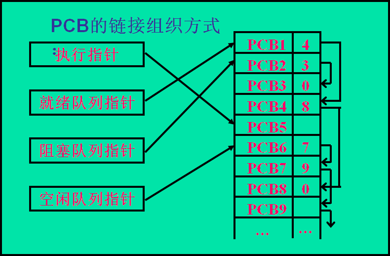
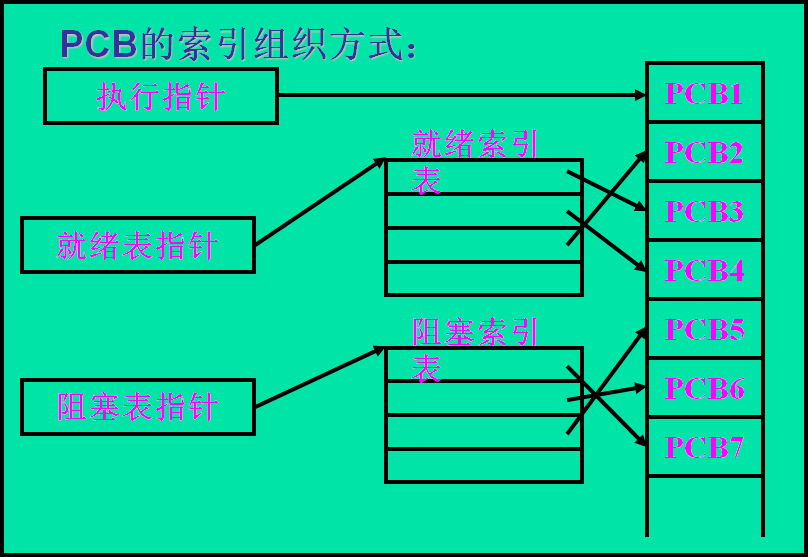

## 二、进程管理

### 1.进程的基本概念

* **程序顺序执行的特征：**

  1）顺序性：处理机严格按照程序所规定的顺序执行，每一步操作必须在下一步操作开始前执行

  2）封闭性：程序在封闭的环境下运行，程序独占资源，资源的状态由程序决定，程序一旦开始执行，外界环境不会影响程序的执行结果。

  3）可再现性：只要程序的初始条件和环境相同，程序的执行结果就相同。

* **程序的并发执行的特征：**（顺序执行会浪费资源）

  1）间断性：程序共享系统的资源，以及为完成同一个任务共同合作，并发执行的程序之间相互制约，（不是运行完一个在运行另一个）

  2）失去封闭性：各程序共享系统资源，资源的状态由各程序所决定。

  3）不可再现性：由于失去了封闭性，（即初始的环境状态和条件相同，程序的执行结果却可能不同），该特征超级垃圾，必须想办法避免。

* **进程的概念：**

  一般认识：

  - 程序在并发环境中的执行过程。
  - 系统进行资源分配和调度的一个独立单位

  总结定义：

  - 进程是进程实体的运行过程，是系统进行资源分配和调度的一个独立单位

* **进程的特征：**

  - 结构特征：

    | PCB（进程控制块），与进程共存亡，用于记录进程的基本情况和活动过程，一般常驻内存 |
    | :----------------------------------------------------------: |
    |   程序段（一般为需要的时候动态调入内存），描述要完成的功能   |
    |  数据段（一般为需要的时候动态调入内存），操作的对象即工作区  |

  - 动态性：进程最基本的特征，进程不是静态的，而是动态的，它由创建而产生，由调度（这里主要指**进程调度**，而不是作业调度）而执行，由撤销而消亡

  - 并发性：指多个进程实体存于内存中，且能在同一时间段内执行，（这里同操作系统的并发性）

  - 独立性：进程实体是一个能独立运行，独立获得资源和独立接收调度的基本单位

  - 异步性：同操作系统的异步性

* **进程的三种基本状态：**

  * 就绪状态：进程已经分配到除了CPU之外的所有资源，只要获得CPU便可以立刻执行，处于就绪状态的进程维持一个就绪队列。
  * 执行状态：已经获得CPU，正在执行的进程。（单处理机系统中，同一时刻只能有一个进程处于执行状态，多处理机系统中，可以同时有多个进程处于执行态）
  * 阻塞状态/等待状态：在执行的过程中由于发生某些事件（I/O请求，申请缓存等），暂时无法执行的进程，是由于进程**本身引起**的阻塞。处于阻塞状态的进程可以维持一个阻塞队列。
  * 进程是自己阻塞自己的，但是阻塞的进程需要其他进程将其唤醒

* **三种基本状态的转换：**

​	就绪—>执行：进程调度，获得CPU资源

​	执行—>就绪：在分时操作系统中时间片花完

​	执行—>阻塞：I/O请求，申请缓存等，自己被迫进入阻塞状态

​	阻塞—>就绪：I/O完成，造成阻塞的原因得到解决

* **进程的创建状态和终止状态**

  创建状态：进程成为就绪状态之前的状态

  终止状态：当一个进程到达了自然结束点，或者遇到无法客服的困难，或者被操作系统所终结等的时候，就进入了终止状态。

* **挂起操作及引入的原因：**

  1）进程被挂起之后处于静止状态。

  2）引入的原因：

  * 终端用户的需要：当终端用户想要暂停自己程序的运行的时候
  * 父进程请求：当父进程想要挂起某个子进程的时候
  * 负荷调节的需要：当实时系统中的工作负荷较重，系统可以将某些不重要的进程挂起，保证程序的正常运行。
  * 操作系统的需要：操作系统有事需要将某些进程挂起，已检查运行过程中资源的使用情况

  3）引入挂起操作后，进程的状态转换：

  

  1）阻塞态可以通过释放变为就绪态。活动阻塞释放变为活动就绪，静止阻塞释放变为静止就绪。

  2）活动态和静止态可以进行相互转换，活动到静止称为挂起，静止到活动可以称为激活。**活动态和静止态最本质的区别为活动态在内存中，静止态暂时调出内存，进入外存**

  3）有执行态可以直接变为静止就绪态，即时间片用完，直接调离内存

  4）静止态（外存）必须通过激活变为非静止态（调入内存）才能够参与进程的三台转换。

* **进程管理中的数据结构**

  * 操作系统中用于管理控制的数据结构：内存表，设备表，文件表，进程表（程序控制快PCB）

  * **进程控制块PCB的作用：**

    * PCB作为进程实体的一部分，用于描述进程的当前情况以及管理进程运行的全部信息，是操作系统中最重要的记录型数据结构。
    * OS用PCB对并发进程进行管理和控制
    * PCB是进程存在的唯一标志
    * PCB是常驻内存的
    * OS专门开辟PCB区，将所有的PCB组成若干个链表或队列。
    * 能实现间断性的运行方式。

  * 进程控制块中的信息：

    * 进程标识符：唯一表示一个进程，有两种：

      1）外部标识符：方便用户对进程的访问，通常有数字和字母组成

      2）内部标识符：方便系统对进程的访问，每一个进程有一个唯一的数字标识符。

    * 处理机状态：（主要指的是处理机中寄存器的状态）

      1）通用寄存器：又称为用户寄存器，用户的程序可以访问，用于暂存信息，一般为8~32个

      2）指令计数器：存放了将要访问的下一条指令的地址。

      3）程序状态字（$PSW$）：含有状态信息，条件码，执行方式（指在系统还是用户状态下执行），中断屏蔽标志（允不允许在执行的过程中被打断）

      4）用户栈指针：每个用户进程都有系统栈，用于存放过程和系统调用参数及调用地址。

    * 进程调度信息

      1）进程状态：指明了进程的当前状态

      2）进程优先级：即一个整数，用于描述进程使用CPU的优先级，数字越大，优先级越高

      3）其他信息：与采用的进程调度算法有关

      4）事件：指进程由执行状态变为阻塞状态所等待发生的事件。

    * 进程控制信息

      1）程序和数据的地址：由于程序段和数据段并不是常驻内存的，而是使用的时候才调入，因此需要保存其地址

      2）进程同步和通信机制：

      3）资源清单：一张清单列出了该进程在运行期间所需的全部资源（除了CPU资源），另一张列出了分配到该进程的资源的清单。

      4）链接指针：给出了本进程（PCB）所在队列中的下一个进程的PCB的首地址。

  * 进程控制块的组织方式：

    * 线性方式：不重要
    * 链接方式：类似静态链表，把具有同一状态的PCB用其中的链接字链接成一个队列，如下图：

    > 0代表结束

    

    * 索引方式：

    

  > 注：进程资源的分配并不是在该进程执行之前将该进程所需的资源全部分配给他，而是在其执行的过程中进行动态的分配。

### 2.进程与程序的区别与关系

* 进程与程序的区别：
  * 进程是一个动态的概念（有 “ 生命 ” ），程序是静态的概念。
  * 进程可以具有并行性（在多处理器的系统中），但是程序没有
  * 进程是竞争系统资源的基本单位
* 进程与程序的关系：
  * 一个程序对应多个进程，一个进程又可以为多个程序服务。

### 3.进程控制

#### 1.基本知识

* 进程控制是进程管理中最基本的功能，主要包括进程的创建，进程的终止和运行中的进程的状态转换等功能。进程控制一般是由**OS的内核中的原语**来实现的。

#### 2.进程的创建

* 进程的层次结构
* 进程图
* **引起进程创建的事件**
  * 用户登录：在分时系统中，用户成功登录，系统将为该用户分配新的进程
  * 作业调度：在多道批处理系统中，作业调度程序将某些作业调度内存，并且为他们创建进程
  * 提供服务：运行中的用户程序提出某种请求
  * 应用请求：由用户进程自己创建，帮助自己完成特定的任务
* ==进程的创建过程：==OS调用进程创建原语Create创建一个新进程
  * 申请空白PCB：新进程获得一个唯一的**数字标识符（对于操作系统）**
  * 为新进程分配器运行所需的资源：包括**物理资源和逻辑资源**
  * 初始化进程控制块PCB：
    * 初始化标识符信息：系统分配的标识符信息装入PCB
    * 初始化处理机状态信息：主要为一些寄存器
    * 初始化处理机控制信息：一般初始化为就绪状态
  * 如果进程就绪队列允许，将进程插入就绪队列

#### 3.进程的终止

* 引起进程终止的事件：
  * 正常结束：完事了
  * 异常结束：1）越界错误（访问自己范围外的），2）保护错误（访问自己无权利访问的）3）非法指令：试图运行不存在的指令，4）特权指令；5）运行超时；6）等待超时；7）算术运算错；8）I/O故障
  * 外界的干预：1）操作员或者操作系统干预；2）父进程的请求（父进程的权利大于子进程）3）父进程的终止：当父进程终止时，其所有子进程也应当终止。
* ==进程终止的过程：==OS调用进程终止原语
  * 根据要终止的进程的标识符，搜索出该进程的PCB，从中获得该进程所处的状态
  * 如果该进程正处于执行状态，立刻终止该进程，并且置调度标志为真，表示在该进程结束后应该进行重新调度（即不要让CPU空闲） 
  * 若该进程有子孙进程，让其所有子孙进程都终止。
  * 被终止进程所拥有的所有资源归还给父进程或者操作系统
  * 将终止进程的PCB从所在队列中移除，等待其他程序来收集信息。

#### 4.进程的阻塞与唤醒

* 引起进程阻塞和唤醒的事件：阻塞和唤醒是相对应的
  * 向系统请求共享资源失败
  * 等待某种操作的完成
  * 新数据尚未到达
  * 等待新任务的到达
* 进程阻塞的过程：**进程**通过调用阻塞原语block==将自己==阻塞
  * 进入block后立即停止执行
  * 保存现场
  * 将进程控制块中的现行状态改为阻塞，并将PCB插入阻塞队列
  * 转调度程序，进行重新调度
* 进程唤醒的过程：**有关进程**（不是本身）调用唤醒原语wakeup，将等待该事件的进程唤醒。
  * 将被阻塞的进程从等待该事件的阻塞队列中移除
  * 将PCB的现行状态由阻塞改为就绪
  * 然后再将该PCB插入就绪队列中
  * 转进程调度或者返回
* block原语和wakeup原语是一对作用刚好相反的原语，必须成对使用。

#### 5.进程的挂起与激活

* 进程的挂起过程：当出现了引起进程挂起的事件之后，OS利用挂起原语将指定的进程挂起（即调出内存）
  * 首先检查进程的状态（不同的状态采取不同的处理方式），若该进程正处于活动就绪状态，将其改为静止就绪态；若该进程处于活动阻塞状态，将该进程改为静止阻塞状态；若该进程处于执行状态，将其改为静止就绪状态，调度程序重新进行调度。
* 进程的激活过程：
  * 首先将进程从外存调入内存，
  * 检查进程所处的状态，如果进程处于静止就绪，将其改为活动就绪，如果处于静止阻塞，将其改为活动阻塞
  * 检查进程的优先级，如果优先级高，可以进行抢占当前运行进程的资源

### 4.进程同步

#### 1.进程同步的基本概念

* 进程同步的目的：对多个相关进程在执行次序上进行协调，是程序具有可再现性。

* 两种形式的制约关系：
  * 间接相互制约关系：多个进程在并发执行时，由于共享系统的临界资源而相互制约，如磁带机，打印机，表格等。
  * 直接相互制约关系：多个进程为完成同一任务而相互合作
* **临界资源：**一次仅允许一个进程使用的共享资源。例如打印机，磁带机，表格等。
* 互斥和同步的概念：
  * 互斥：并发的多个进程由于竞争同一资源而产生的相互排斥的关系
  * 同步：进程间共同完成一项任务时直接发生相互作用的关系
* **临界区：**每个进程中访问临界资源的那段**代码**

~~~c
/*一个访问临界资源的循环进程*/
while(true)
{
    进入区：//对欲访问的临界资源进行检查，查看其是否正被访问，如果此刻临界资源未被访问，进程便可以进入临界区对临界资源进行访问，并设置它正被访问的标志，如果此刻临界资源正被访问，则不能进入临界区。
    临界区：
    退出区：//将临界区正被访问的标志恢复为未被访问的标志
    剩余区：//除上述三个区之外的代码叫做剩余区
}
~~~

* 同步机制应遵循的原则：
  * 空闲让进
  * 忙则等待
  * 有限等待：不能一直等
  * 让权等待：进程不能进入临界区，就应当释放==处理机==

#### 2.硬件同步机制

#### 3.信号量机制：Dijkstra提出

* 信号量：
  * 是一种数据结构
  * 值与相应资源的使用情况有关
  * 仅与P，V操作有关，**P，V**代表两种**原子操作**，P为等候原语wait（S）,V为释放原语signal（S）。
  * 原子操作的特点，操作一开始执行，半中间不可以打断，原语即为原子操作。

* 整型信号量

  * 概念：Dijkstra把整型信号量定义为一个用于表示资源数目的整型量S。

  ~~~c
  /*等候原语*/
  wait(S){
      while(S <= 0);  //当S<=0的时候便一直处于等待状态，直到获得相应的资源      ------等待开门
      S--;     //获得资源后，资源的数目减一      --------锁门
  }
  
  /*释放原语*/
  signal(S){
      S++;      //释放资源后，资源的数目加一      -------开门
  }
  ~~~

  * 优缺点：

    优点：实现简单

    缺点：违背了同步机制中的让权等待原则（只要S<=0，就会等待）

* **记录型信号量：**当前用的最多的

  * 特点：采用了记录型的数据结构

  ~~~c
  /*记录型数据结构*/
  typedef struct{
      int value;      //>=0的时候，表示系统中可用资源的数量，<0的时候其绝对值表示因为该资源而阻塞					 //的进程的数目
      struct process_control_block *list;    //维持阻塞队列的指针
  }semaphore;
  
  /*等待原语*/
  wait(semaphopre *S){
      S->value--;    //一个进程过来，首先将S->value--；
      if(S->value < 0){     //<0表示资源已经用光，将该进程加入阻塞队列
          block(S->list);
      }
  }
  
  /*释放原语*/
  signal(semaphore *S){
      S->value++;      //释放资源，S->value++；
      if(S->value <= 0){      //S->value++之后，还<=0，直接唤醒一个阻塞的进程，如果>0，直接将							//资源释放即可
          wakeup(S->list);
      }
  }
  ~~~

  * wait操作：每次都相当于进程请求一个单位的该类资源

    signal操作：每次都相当于释放一个单位资源

  * 当S->value的初值为1的时候，表示只允许一个进程访问临界资源，信号量转化为互斥型信号量

* AND型信号量：解决记录型信号量会发生的死锁的问题

  * 当一个进程需要两个或者更多的共享资源来完成一个目标的时候，多个进程之间可能会发生阻塞（刚开始前半部分资源占有了，但是后半部分资源无法获得，自己再阻塞自己，即发生了死锁）
  * AND的解决思想：将一个进程运行过程中所需要的全部资源一次性都分给他，待进程使用完之后，在一起进行释放。

  ~~~c
  /*等候原语：全分配*/
  Swait(S1, S2, …, Sn)
   {
      While(TRUE)
      {
      	if (S1 >=1 and … and Sn>=1 ){
            	for( i=1 ;i<=n; i++) Si - -;
  			break;
  		}
          else{
              Place the process in the waiting queue associated  with the first Si found with Si <1,and set the progress count of this process to the beginning of Swait operation	
          }
      }
  }
  
  /*释放原语：全释放*/
  Ssignal(S1, S2, …, Sn){
  	while(TRUE){    
  		for (i=1; i<=n; i++) {
              Si++ ;
              Remove all the process waiting in the queue associated with Si into the ready queue
    		 }
  	}
  }
  ~~~

* 信号量集

#### 4.信号量的应用

* 利用信号量实现进程互斥

  * 多个进程**互斥**的访问某种临界资源

  ~~~c
  /*代码描述*/
  semaphore mutex = 1;        //互斥信号量
  
  PA(){
      while(1){
          wait(mutex);       //申请分配资源
          //临界区
          signal(mutex);     //释放资源
          //剩余区
      }
  }
  
  PB(){
      while(1){
          wait(mutex);       //申请分配资源
          //临界区
          signal(mutex);     //释放资源
          //剩余区
      }   
  }
  
  /*
  注：当某一个进程获得资源之后，另一个进程便无法获得该资源，因此实现了对临界资源的互斥访问
  */
  ~~~

  * 注意：wait（）和signal（）必须成对的出现。

    缺少wait（）：导致系统混乱，不能保证对临界资源的互斥访问

    缺少signal（）：临界资源永远不能被释放，因等待该临界资源而阻塞的进程也永远不能被唤醒

### 5.经典的进程同步问题

* 生产者消费者问题
  * 生产者进程和消费者进程都以异步方式运行，  但它们之间必须保持同步。
  * 可利用**互斥信号量**$mutex$实现诸进程对缓冲池的互斥使用（不可以同时既向缓冲区中放入数据，又从缓冲区中拿出数据）；利用**资源信号量**empty和full分别表示缓冲池中空缓冲池和满缓冲池的数量。  假定这些生产者和消费者相互等效

  ~~~c
  /*
  in表示放入数据的地址，out表示取出数据的地址
  buffer[n]：表示大小为n的缓冲池（由多个缓冲区组成） 
  mutex：互斥型信号量，初值为1
  empty，full：资源型信号量，empty表示空缓冲区的数量，full表示满缓冲区的数量
  item：表示一个数据项
  */
  Int in=0,out=0;  
  Item buffer[n];   
  Semaphore mutex=1,empty=n,full=0;  
  
  //生产者
  Void producer(){ 
   	do{
  		生产一个产品放入nextp;
          
          /*进入区*/
  		wait(empty);
  		wait(mutex);
          
          /*临界区*/
  		buffer[in]=nextp;
  		in=(in+1) % n;
          
          /*退出区*/
  		signal(mutex);
  		signal(full);
  	}while(TRUE)
  }
  
  //消费者
  Void consumer(){ 
      do{
  	   wait(full);
  	   wait(mutex);
  	   nextc =buffer[out];
  	   out =(out+1) mod n;
  	   signal(mutex);
  	   signal(empty);
  	   消费 nextc中的产品;                        
  	}while(TRUE)
  }
  
  
  Void main(){
  	cobegin
  	    proceducer();
   	    consumer();
  	coend
  }
  ~~~

  * 注意：

    1）每个程序的互斥操作wait（）和signal（）必须成对的出现。

    2）输入进程不可以向满的缓冲池中输入数据，计算进程不可以从空的缓冲池中取数据

  * 在每个程序中的多个wait操作顺序不能颠倒，必须先执行对资源信号量的wait操作，在进行对互斥信号量的wait操作，否则可能引起进程死锁。

* 读者—写着问题

  * 问题核心：保证一个**Writer**进程必须与其他进程**互斥地**访问共享对象的同步问题。
  * 只要求读文件的进程称为“Reader进程”，其它进程则称为“Writer进程”。
  * 允许多个进程同时读一个共享对象，但不允许一个Writer进程和其他Reader进程或Writer进程同时访问共享对象（共享对象并不是临界资源，因为他允许多个进程对其访问）

  ~~~c
  /*
  记录型信号量解决读者—写者问题
  
  rmutex：读进程对Readcount的互斥
  wmutex：writer对reader和writer的互斥
  readcount：表示正在读的进程数目，只有当readcount=0的时候才需要申请wmutex权限，大于0的时候不需要
  */
  
  semaphore rmutex=1, wmutex =1;
  int readcount =0;
  Void Reader(){
  	do{
  		wait(rmutex);          //防止多个reader进程对readcount的访问
  		if (Readcount==0){    //如果readcount不等于0，表示有进程正在进行读操作，绝对没有写操作
  			wait(wmutex);
  		}
  		Readcount ++;
  		signal(rmutex);
  		…
  		读;
  		…
  		wait(rmutex);
  		Readcount - -;
  		if (Readcount==0){      //只有等于0的时候才需要释放资源，使得写进程可以工作
  			signal(wmutex);
  		}
  		signal(rmutex);
  	}while(TRUE);
  }
  Void writer(){
      do{
          wait(wmutex);      //申请写权限的资源
          写;
          signal(wmutex);
      }while(TRUE);
  }
  
  Void main(){
      cobegin
         reader();  writer();
  	Coend
  }
  ~~~

* 哲学家的进餐问题

  > 五个哲学家共用一张圆桌，分别坐在周围的五张椅子上，在桌子上有五只碗和五只筷子，他们的生活方式是交替地进行思考和进餐。平时，一个哲学家进行思考，饥饿时便试图取用其左右最靠近他的筷子，只有在他拿到两只筷子时才能进餐。进餐毕，放下筷子继续思考。

  ~~~c
  /*
  记录型信号量解决问题
  */
  //每一只筷子均为临界资源
  semaphore chopstick[5]={1,1,1,1,1};
  //所有的信号量均被初始化为1，第i位哲学家的活动可描述为：
  do{
  	wait(chopstick[i]);          //拿左手的筷子
  	wait(chopstick[(i+1) mod 5] );      //拿右手的筷子
  	…
  	eat;
  	…
  	signal(chopstick[i]);    //放左手
  	signal(chopstick[(i +1)mod 5]);       //放右手
  	…
  	think;
  }while(TRUE);
  ~~~

  > 存在的问题：假如五位哲学家同时饥饿而各自拿起左边的筷子时，就会使五个信号量chopstick均为0，当他们再试图去拿右边的筷子时，都将因无筷子可拿而无限等待。进入死锁状态。

  **解决办法：**

  * 至多只允许有四位哲学家同时去拿左边的筷子，最终能保证至少有一位哲学家能够进餐，并在用毕后释放出他用过的两只筷子，从而使更多的哲学家能够进餐。
  * 仅当哲学家的左右两只筷子均可用时，才允许他拿起筷子进餐。
  * 规定奇数号哲学家先拿他左边的筷子，然后再去拿右边的筷子；偶数号哲学家则相反。
  * 使用AND型信号量

  ~~~c
  /*
  使用AND型信号量解决
  */
  semaphore chopstick[5]={1,1,1,1,1};
  Philosopher i
  do{
  	think;
  	Swait(chopstick[(i+1)mod 5],chopstick[i ]);     //同时分配两只筷子
  	eat;
  	Ssignal(chopstick[(i+1)mod 5], chopstick[i ] );     //同时放下两只筷子  
  }while(TRUE)
  ~~~

### 6.进程通信

#### 1.基本知识

* 概念：即进程之间的信息交换

* 分类：首先分为低级通信和高级通信：

  低级：进程间仅交换一些状态和少量数据。常见的有进程的互斥与同步。低级的原因：1）效率低（传递的数据量小），2）不透明

  高级：进程间可交换大量数据。是指用户可直接利用操作系统所提供的一组**通信命令**，高效地传送大量数据的一种通信方式。高级的原因：1）效率高（可以传送大量的数据）2）对用户透明

* 进程通信的类型：1）共享存储器系统；2）管道通信系统；3）消息传递系统

#### 2.进程通信的类型

* 共享存储器系统：相互通信的进程间共享某些数据结构或共享存储区，通过这些空间进行通信。

  * 基于共享数据结构的通信方式

    进程公用某些数据结构，借以实现诸进程间的信息交换。效率低，传递的数据量小，属于低级通信，例如生产者—消费者问题中的缓冲区

  * 基于共享存储区的通信方式

    在存储器中划出一块共享存储区，诸进程间实现通信。1）进程在通信前，先向系统申请获得共享存储区中的一个分区，并指定该分区的关键字；2）把获得的共享存储分区连接到需要进行通信的进程上；此后，便可像读、写普通存储器一样地读、写该公用存储分区

* 消息传递系统：进程间的数据交换，以**格式化的消息（例如计算机网络中的报文）**为单位

  * 直接通信方式：发送进程1）利用OS提供的发送命令，2）**直接**把消息发送给目标进程。发送进程和接收进程都以3）**显式方式**提供对方的**标识符**

    使用直接通信方式解决生产者消费者问题：

  ~~~c
  /*
  通信原语：
  Send(Receiver, message);     发送一个消息给接收进程
  Receive(Sender, message);    接收Sender发来的消息
  第一个参数为进程标识符，第二个参数为信息
  */
  
  Producer:
      repeat
  	   …
  	   produce an item in nextp;
  	   …
  	   send(consumer, nextp);
      until  false;
  
  Consumer:
      repeat
  	   receive(producer, nextc);
  	   …
  	   consume the item in nextc;
      until  false;
  ~~~

  * 间接通信方式：进程之间的通信需要通过某种中间实体，该实体用来暂存发送进程发送给目标进程的消息；接受进程则从该实体中取出对方发送给自己的消息。该实体被称为**信箱**。消息在信箱中可安全保存，只允许核准的目标用户随时读取利用信箱通信方式，既可实时通信，又可非实时通信。

    **信箱的分类：**私用信箱，公用信箱，共享信箱

    **信箱的创建和撤销：**进程用信箱创建原语来建立一个新的信箱，创建者进程应给出信箱的名字和属性。对于共享信箱，还应该指出共享者的名字。

    **消息的发送和接收：**

  ~~~c
  /*
  将消息发送至信箱，再从信箱中取
  */
  Send(mailbox, message);  将一个消息发送到指定信箱
  Receive(mailbox, message);  从指定信箱中接收一个消息
  
  /*
  私用信箱：
  由用户进程建立，拥有者有权从中读信息，其他用户只能向其中发送信息，采用单向通信链路，信箱属于进程的进程结束时信箱消失
  公用信箱：
  由操作系统创建，可以供系统中所有的核准进程使用，进程既可以从中取出也可以发送，使用双向通信链路的信箱来实现，系统运行期间始终存在
  共享信箱：
  由某个进程创建，创建时提供共享进程的名字，信箱的共享者和拥有者都有权从信箱中取走发送给自己的消息
  */
  ~~~

* 管道通信系统

### 7.线程

#### 1.线程的引入

* 在传统的操作系统中引入进程的目的是为了使多个程序能够并发执行，以提高资源利用率和系统吞吐量；而线程的引入是为了**减少程序在并发执行时所付出的时空开销**，使OS具有更好的并发性。
* 线程在多处理机操作系统和网络操作系统中应用较为广发，因为多涉及进程的切换。
* 进程的两个基本属性：1）一个可拥有资源的独立单位；2）进程同时又是一个可独立调度和分派的基本单位
* 线程的基本属性：1）轻型实体 （为进程的一个实体）， 只有一点必不可少的、能保证独立运行的资源；2）独立调度和分派的基本单位；3）可并发执行；4）共享进程资源
* 线程和进程之间的关系：线程是属于进程的，线程运行在进程空间内，同一进程所产生的线程共享同一物理内存空间，当进程退出时该进程所产生的线程都会被强制退出并清除。进程仍然是拥有独立资源的基本单位，但是线程是可独立调度和分派的基本单位。