# 4. 存储器管理

## 4.1 存储器的层次结构

### 4.1.1 多层结构的存储器系统

**1. 存储器的多层结构**

> 寄存器，高速缓存，主存，磁盘缓存属于操作系统的管辖范围，掉电后存储的信息将不再存在。
>
> 固定磁盘和可移动存储介质中存储的信息会被长期的保存。

**2. 可执行存储器**

寄存器和主存储器被称为可执行存储器。

> os主要提供对可执行存储器的分配、回收、以及存储层次间数据的移动等。
>
> 用户主要负责对设备和文件的管理

## 4.2 程序的装入和链接

> **将用户源程序变为可在内存中执行的程序的步骤：**
>
> 1. 编译：由编译程序将用户源代码编译成若干个目标模块
>
> 2. 链接：由链接程序将编译后形成的一组目标模块，以及它们所需要的库函数链接在一起，形成一个完整的装入模块
>
> 3. 装入：由装入程序将装入模块装入内存

示意图：

### 4.2.1程序的装入

背景：将单个目标模块装入内存时的三种装入方式

需要注意的是程序中的逻辑地址和在内存中的物理地址的关系。

**1. 绝对装入方式**

**内容：**装入模块装入内存后，程序中的逻辑地址与实际内存地址完全相同，不须对程序和数据的地址进行修改。程序中所使用的绝对地址，可在编译或汇编时给出，也可由程序员赋予。通常在程序中采用符号地址，然后在编译或汇编时，再将这些符号地址转换为绝对地址。

**注意：**仅适用于单道程序的运行环境。

**2. 可重定位装入方式**

**产生的原因：**上述的绝对装入方式只能将程序装入到内存的指定位置，只适合单道程序的运行环境，不适用于多道程序的处理环境。

**原理：**为了克服上述的缺点，在多道程序环境下，目标模块的起始地址（逻辑地址）通常从0开始，程序中的其他地址都是相对于起始地址计算的。因此应采用可重定位装入方式，根据内存的当前情况，将装入模块装入到内存的适当位置。

装入时，会对目标程序中指令和数据的地址（逻辑地址）进行修改（修改为物理地址），修改的过程称为重定位。由于修改的过程是在装入时一次完成，以后不可改变，因此又被称为**静态重定位**。

**示意图：**

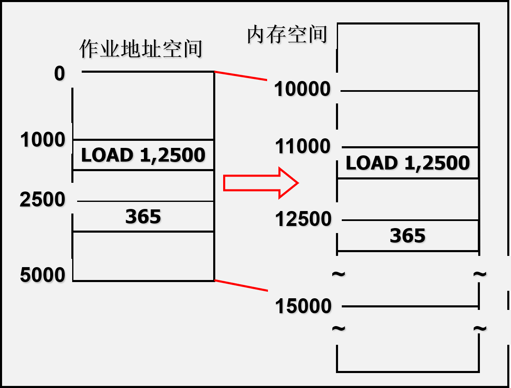

**缺点：**不允许程序在内存中进行移动

**3. 动态运行时装入方式**

**产生的原因：**克服程序在内存中无法移动的缺点。

**原理：**可重定位的装入方式，程序装入内存之后便无法进行移动。但在实际上，在运行过程中程序在内存中的位置可能经常要改变。动态运行时的装入程序，在把装入模块装入内存后，并不立即把装入模块中的相对地址转换为绝对地址，而是把这种**地址转换推迟到程序真正要执行时才进行**。因此，装入内存后的所有地址都仍是**逻辑地址**。为使地址转换不影响指令的执行速度，应设置一个**重定位寄存器**。

### 4.2.3 程序的链接

背景：程序经过编译后得到一组目标模块，再利用链接程序将目标模块链接，形成装入模块。根据链接时间的不同，把链接分成三种：

**1. 静态链接方式**

**原理：**

在程序运行前，将目标模块及所需的库函数链接成一个完整的装配模块（也叫做可执行文件），以后不再拆开。这种方式称为静态链接方式。

将目标模块装配成装入模块时需解决的两个问题：

1. 对相对地址进行修改：将模块A,B,C连成一个模块的时候，原模块B和模块C的起始地址不再是0，分别变为L和（L + M），所以需要对B和C中的相对地址进行修改。

2. 变换外部调用符号：外部调用符号即下方的Call B和Call C中的B和C，在将多个模块连接成一个的时候，所有模块的相对地址均已经发生变化，所以需要对外部调用符号也进行相应的变化。

**示意图：**

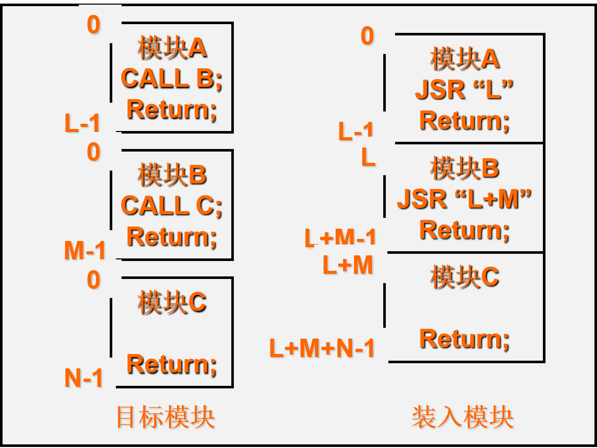

**缺点：**

1）不便于修改和更新；2）无法实现对目标模块的共享。

**2. 装入时动态链接**

**产生的原因：**克服静态链接方式的缺点：1）不便于修改和更新；2）无法实现对目标模块的共享。

**原理：**用户源程序经编译后所得的目标模块，是在装入内存时，边装入边链接的，即在装入一个目标模块时，若发生一个外部模块调用事件，将引起装入程序去找出相应的外部目标模块，并将它装入内存，还要修改目标模块中的相对地址（修改的方式同上）。

**优点：**

1. 便于修改和更新：各目标模块分开存放，便于修改，在装入内存的时候才进行连接。
2. 便于实现对目标模块的共享：静态链接方式中，每个应用模块均必须含有对目标模块的拷贝，无法实现共享。采用装入时动态链接，只需要装入时，将目标模块连接到应用模块上即可。

缺点：

1. 盲目的将目标模块装入内存，效率低。

**3. 运行时动态链接**

**产生的原因：**克服装入时动态链接的缺点（盲目地将可能会用到的模块全部装入内存），提高效率。

**原理：**运行时动态链接是将对某些模块的链接推迟到执行时才执行，即在执行过程中，当发现一个被调用模块尚未装入内存时，立即由OS去找到该模块并将之装入内存，把它链接到调用者模块上。凡执行过程中未被用到的目标模块，不会调入内存和链接，这样不仅加快程序的装入过程，而且节省大量的内存空间。

## 4.3 连续分配存储管理方式

为了将用户程序装入内存，需要在内存中为用户程序分配一定大小的内存空间。连续分配方式是为一个用户程序分配一个**连续**的内存空间，主要分为：单一连续分配，固定分区分配，动态分区分配，可重定位分区分配

### 4.3.1单一连续分配

**1. 概述**

最简单的一种存储管理方式，但只能用于**单用户、单任务**的操作系统中。

采用这种存储管理方式时，可把内存分为系统区和用户区两部分，系统区仅提供给OS使用，通常放在内存低址部分，用户区是指除系统区以外的全部内存空间，提供给用户使用。

**2. 缺点**

内存中仅装有一道用户程序，内存空间由该用户程序独占。

### 4.3.2 固定分区分配

**1. 产生的原因**

单一连续分区分配方式仅适用于当用户单任务的操作系统中，效率低下，浪费资源

**2. 原理**

​	将内存用户空间划分为若干个**固定大小的区域**（可以相等也可以不相等），在每个分区中只装入一道作业，这样把用户空间划分为几个分区，便允许有几道作业**并发执行**。当有一空闲分区时，便可以再从外存的后备作业队列中，选择一个适当大小的作业装入该分区，当该作业结束时，可再从后备作业队列中找出另一作业调入该分区。

**3. 两种划分分区的方法**

1）分区大小相等：缺乏灵活性，并且**容易产生大量的内碎片**，造成资源的浪费。常用于一台计算机控制多个相同对象的场合。

2）分区大小不等：把内存区划分成含有多个较小的分区、适量的中等分区及少量的大分区，可根据程序的大小为之分配适当的分区。

**4. 内存分配的实现方式**

​	为便于内存分配，通常将分区按大小进行排队，并为之建立一张分区使用表，其中各表项包括每个分区的起始地址、大小及状态(是否已分配)。

​       当有一用户程序要装入时，由内存分配程序检索该表，从中找出一个能满足要求的、尚未分配的分区，将之分配给该程序，然后将该表项中的状态置为“已分配”；若未找到大小足够的分区，则拒绝为该用户程序分配内存。

**示意图：**

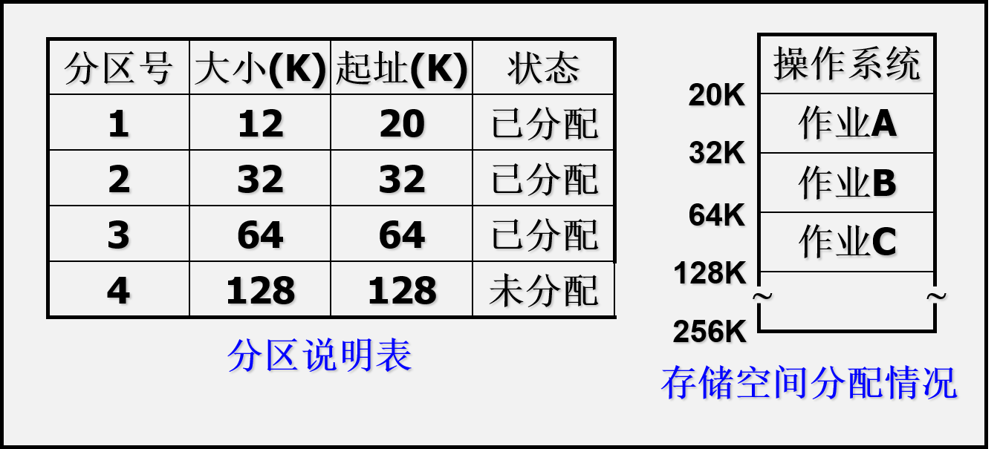

**5. 缺点**

1. 容易产生大量的内碎片，造成资源的浪费。
2. 分区总数固定，限制并发执行的程序数目

> 内碎片：由于作业容量和分区容量不完全相符而产生的空间碎片。
>
> 外碎片：由于大量的信息先后写入，删除，置换而形成的空间碎片。

### 4.3.3 动态分区分配

**1. 产生的原因**

主要是想解决固定分区分配方式中会产生大量的内碎片的问题。

**2. 原理**

动态分区分配是根据进程的实际需要，动态地为之分配内存空间。作业装入内存时，把可用内存分出一个连续区域给作业，且分区的大小正好适合作业大小的需要。分区的大小和个数依装入作业的需要而定。

#### 4.3.3.1 在实现的过程中需要解决的三个问题

1. 分区分配中的数据结构

2. 分区分配算法

3. 分区分配及回收操作

**1. 涉及到的数据结构**

对于空闲分区：使用空闲分区表或者空闲分区链

对于已占分区：使用已占分区表

具体数据结构的格式见课本137页。

**2. 动态分区分配算法**

主要的目的：从空闲分区表或空闲分区链中选出一分区分配给该作业。主要算法有三种：首次适应算法，循环首次适应算法，最佳首次适应算法

具体的算法见下文：[点击](#4332-分区分配算法)

**3. 分区分配操作**

主要操作是对内存进行回收和分配。

**1）分配内存**

核心流程：

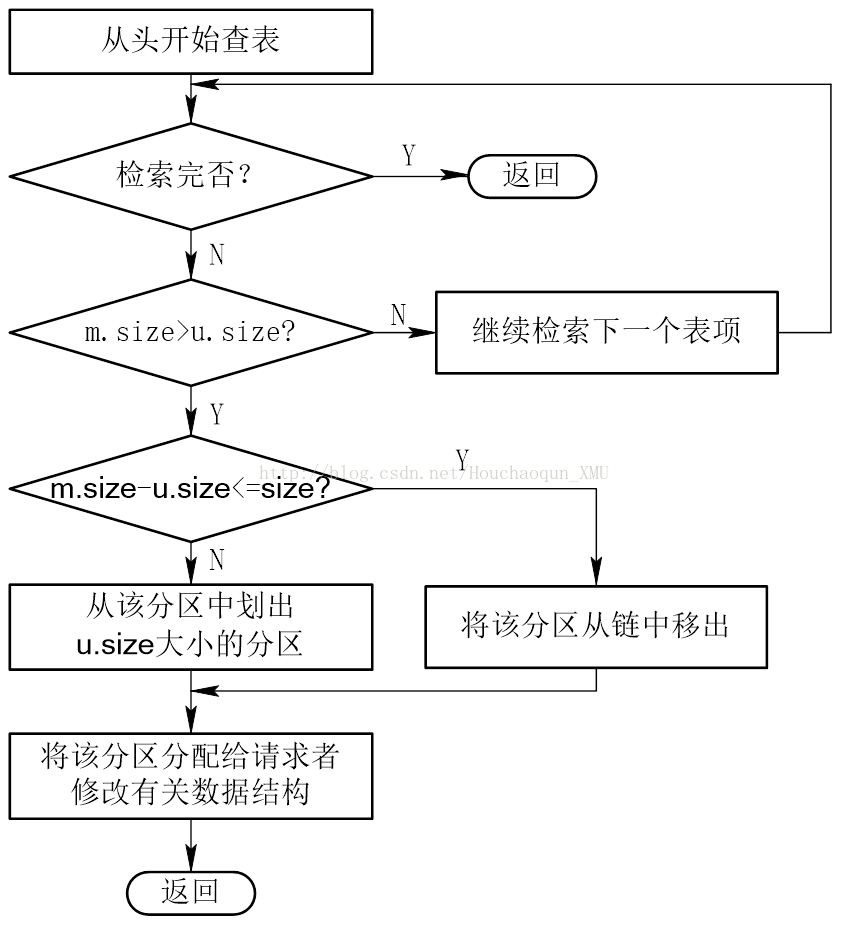

> 一些数据的解释
>
> m.size：每个空闲分区的大小
>
> u.size：请求分区的大小
>
> size：系统设置的阈值

**2）回收内存**

根据回收区的首地址在空闲分区表中找到相应的插入点，进行回收，会出现以下四种情况：

(1) 回收区与插入点的前一个分区F1邻接：将回收区与F1合并，修改F1的表项的分区大小

(2) 回收区与插入点的后一个分区F2邻接：将回收区与F2合并，修改F2的表项的首址、分区大小

(3) 回收区与插入点的前后两个分区F1、F2邻接：将三个分区合并，使用F1的表项和F1的首址，取消F2的表项，大小为三者之和

(4) 回收区既不与F1邻接，又不与F2邻接：为回收区单独建立新表项，填写回收区的首址与大小，根据其首址插到空闲链中的适当位置

示意图如下：

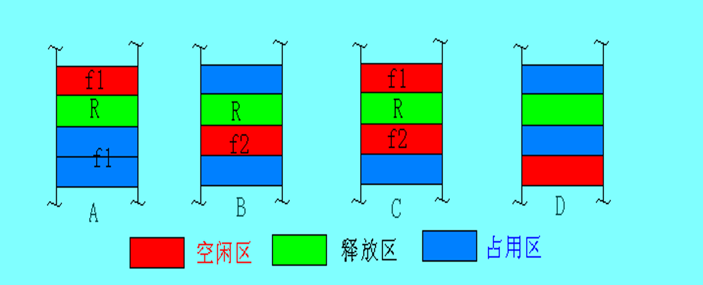

#### 4.3.3.2 分区分配算法

**1. 首次适应算法**

​	FF算法要求空闲分区表以地址递增的次序排列。在分配内存时，从表首开始顺序查找，直至找到一个大小能满足要求的空闲分区为止；然后按照作业的大小，从该分区中划出一块内存空间分配给请求者，余下的空闲分区仍留在空闲分区表中。若从头到尾不存在满足要求的分区，则分配失败。

**优点：**优先利用内存低址部分的内存空间

**缺点：**低址部分不断划分，产生小碎片（内存碎块、内存碎片、零        头）；每次查找从低址部分开始，增加了查找的开销

**2. 循环首次适应算法**

​	在分配内存空间时，从上次找到的空闲分区的下一个空闲分区开始查找，直到找到一个能满足要求的空闲分区，从中划出一块与请求大小相等的内存空间分配给作业。需要设置一个查询指针，记录上一次查找到的位置。

**优点：**使内存空闲分区分布均匀，减少查找的开销

**缺点：**破坏了大的空闲分区

**3. 最佳适应算法**

每次为作业分配内存时，总是把能满足要求、又是最小的空闲分区分配给作业，避免“大材小用”。要求将所有的空闲分区按其容量以**从小到大**的顺序形成一空闲分区链。

**优点：**避免了大材小用

**缺点：**产生许多难以利用的小空闲区

### 4.3.4 动态可重定位分区分配

**1. 产生的原因**

​	在连续分配方式中，必须把系统或用户程序装入一连续的内存空间。如果在统统中只有若干个小分区，即使它们的容量总和大于要装入的程序，但由于这些分区不相邻，所以无法将程序装入内存。

**2. 解决办法**

​	将内存中的所有作业进行移动，使它们全部邻接，这样可把原来分散的小分区拼接成大分区，这种方法称为“拼接”或“紧凑”。

注意：若想实现需要借助重定位寄存器， ————>与上边的动态运行时装入方式相适应

**3. 实现方式**

​	在动态运行时装入的方式时，将相对地址转换为物理地址的工作在程序指令真正要执行时才进行。地址转换需要重定位寄存器的支持。程序执行时访问的内存地址是相对地址与重定位寄存器中的地址相加而成。

**示意图：**

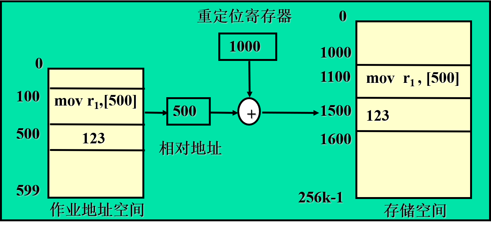

**4. 算法执行的具体流程图**

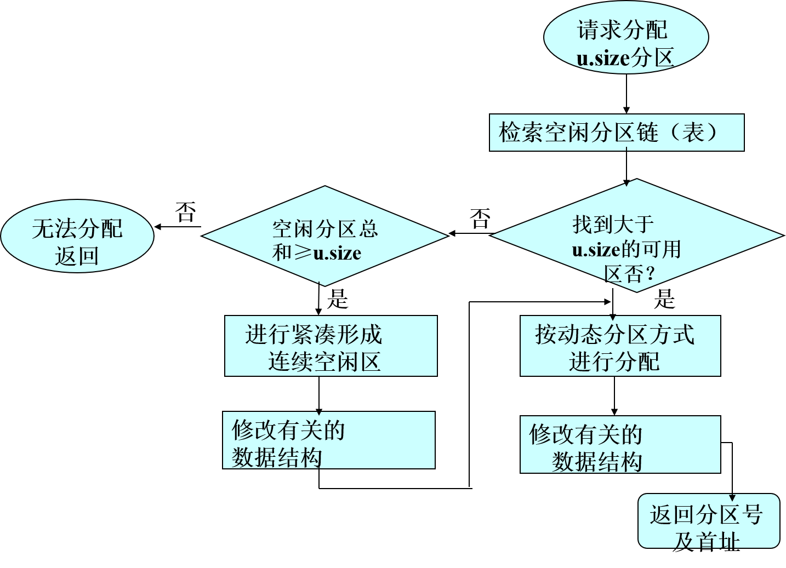

## 4.4 对换

### 4.4.1 对换的引入

**1. 多道程序环境下存在的问题：**

* 阻塞进程占据大量内存空间

* 许多作业在外存而不能进入内存运行

**2. 对换的概念**

​	把内存中暂时不能运行的进程或者暂时不用的程序和数据，调到外存上，以便腾出足够的内存空间，再把已具备运行条件的进程和进程所需要的程序和数据，调入内存。

**3. 对换的分类：**

* 整体对换(或进程对换)：以整个进程为单位

*  页面对换或分段对换：以页或段为单位（基本的分页和分段存储管理方式均不支持对换功能）

### 4.4.2 对换空间的管理

如下图：

对**对换区空间的管理**涉及到的数据结构和**对换空间的分配与回收**与动态分区方式时内存的分配与回收的方法雷同

### 4.4.3 进程的换出和换入

**1. 进程的换出**

​    换出过程：系统首先选择处于**阻塞状态且优先级最低**的进程作为换出进程，然后启动盘块，将该进程的程序和数据传送到磁盘的**对换区**上。

> 注意：
>
> 1. 对于共享的程序和数据段只要有程序需要就不能将其换出
> 2. 换出只是将进程的程序和数据段进行换出，进程控制块仍然处于内存之中

**2. 进程的换入**

​	换入过程：系统应定时查看**PCB集合（PCB是常驻内存的）**中所有进程的状态，从中找出“就绪”状态但已换出的进程，将换出进程最久的进程作为换入进程，将之换入，直至已无可换入的进程或无可换出的进程为止。

## 4.5 分页存储管理方式

> 1. 分页存储管理方式和分段存储管理方式均属于离散型分配方式，分页存储的基本分配单位是页，分段存储的基本单位是段。
> 2. 基本的分页存储管理方式(或纯分页存储管理方式)：**不具备页面对换功能**，不具有支持实现虚拟存储器的功能，要求把每个作业全部装入内存后方能运行。

### 4.5.1 页面与页表

**1. 分页式存储管理的原理**

​           分页存储管理是将一个进程的逻辑地址空间分成若干个大小相等的片称为页面或页，并为各页加以编号，从0开始。同时把内存空间分成与页面相同大小的若干个存储块，称为块或页框，也从0开始编号。在为进程分配内存时，以块为单位将进程的若干个页分别装入到多个可以不相邻的物理块中。**进程的最后一页经常装不满而形成“页内碎片”。**

**2.基本分页式存储管理（简单页式存储管理/纯分页存储管理方式）的原理**

​    系统若能满足一个作业所要求的全部块数，此作业才能被装入内存，否则不为它分配任何内存。

**3.请求分页式存储管理的原理**

​    运行一个作业时，并不要求把该作业的全部程序和数据都装入内存，可以只把目前要执行的几页调入内存的空闲块中，其余的仍保存在外存中，以后根据作业运行的需要再调入内存。

**4. 页面大小的选择**

分页式存储管理方式页面的大小由硬件所决定，对用户来说是透明的

系统选取的页面大小应当适中，不能够太大，也不能够太小

太小：内碎片少，内存利用率高，但页面数目多，使页表过长，占大量内存，管理开销大

太大：页表短，管理开销小，内碎片大，内存利用率低

因此，一般选为512B~8KB较为合适

**5. 页表的基本结构**

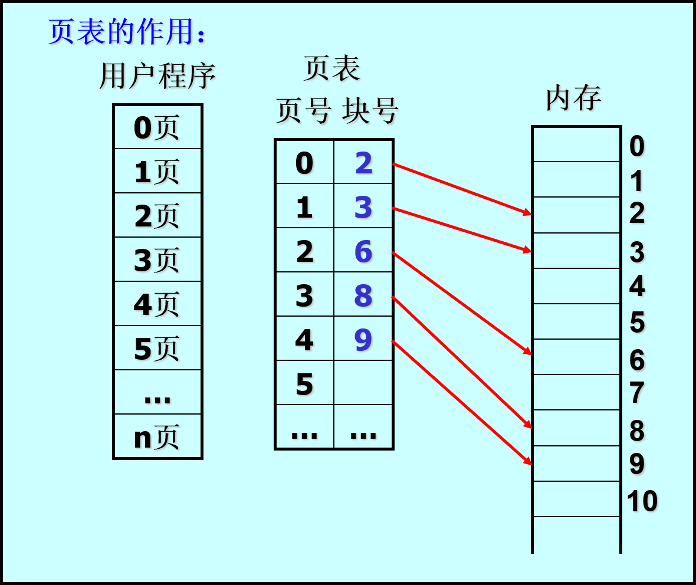

页表包括两个字段：

1. 页号
2. 块号

**6. 页表的作用**

实现了从页号到物理块号的地址映射

**7. 总结**

采用分页式存储管理方式每访问一次数据需要访问两次主存，第一次是访问页表，第二次根据页表得到的物理地址访问数据

**8. 地址结构**

分页地址中地址结构分为页号和页内地址两部分。

页号 =  逻辑地址对页面大小取整

页内地址 = 逻辑地址对页面大小取余

### 4.5.2 地址变换机构

**主要任务：**地址变换机构实现从逻辑地址到物理地址的转换，其任务是借助于页表，将逻辑地址中的页号转换为内存中的物理块号。

**1. 基本的地址变换机构**

​        在系统中只设置一个页表寄存器PTR，在其中存放页表在内存中的始址和页表的长度。

​	页表在内存中是连续存储的。

**2. 分页系统的地址变换机构**

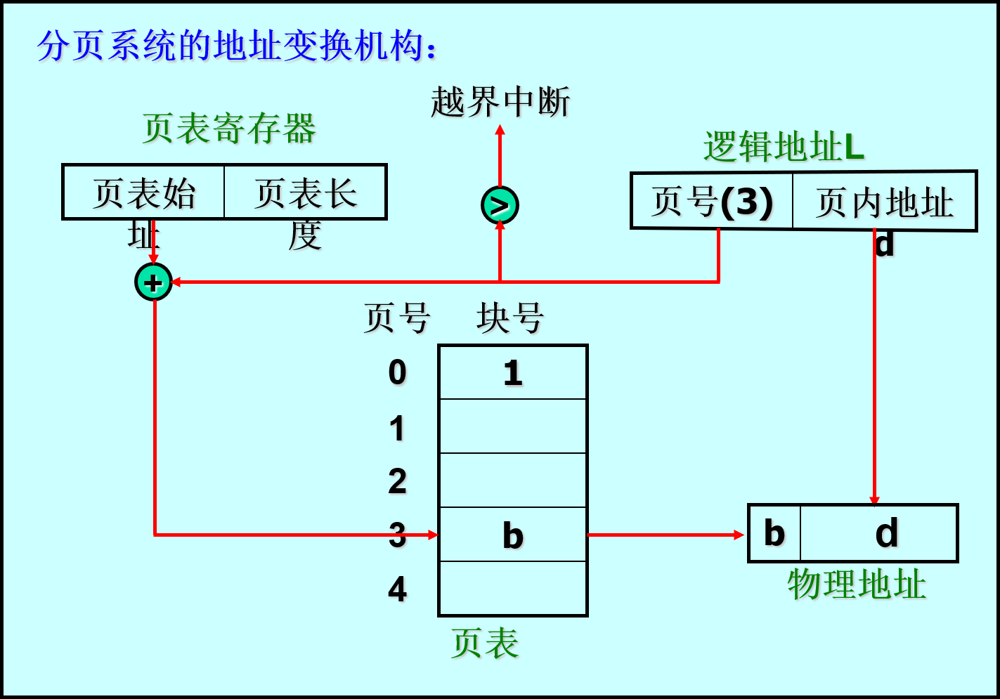

**3. 执行过程**

​	当进程或作业要求分配主存块时，首先检查是否有足够的空闲块，如果没有，则本次无法分配。如果有则首先分配设置页表，将分到的主存快号添入页表中。

　　当调度一个作业执行时，首先将页表始址及大小装入页表寄存器。作业执行过程中CPU产生的每一个逻辑地址，由硬件地址变换机构自动将其分成两部分：一部分为页号，另一部分是页内位移量。这个页号先与**页表寄存器中的当前页表大小**进行比较。如果页号太大，表示**访问越界**，系统产生越界中断。如果页访问是合法的，则由页表始址和页号计算出所对应的物理块号；然后，取出其存取控制字段，作存取控制验证，若合法则将物理块号与逻辑地址中的位移量拼接，形成最终访问的物理地址。否则，产生相应访问非法中断。

> 页表
>
> 页表在大多数的情况下常驻内存，系统只设置一个页表寄存器，其中存放的是页表的首地址和页表的长度。页表的长度用来判断是否发生越界中断。每一个进程都将页表的始址和页表长度保存在进程PCB中，进程运行的时候才将这两个数据装入页表寄存器。

**4. 快表**

增加了一个具有并行查寻能力的特殊高速缓冲寄存器，联想寄存器，根据程序访问的局部性原理，将快表的一部分内容保存至联想寄存器中。

示意图：

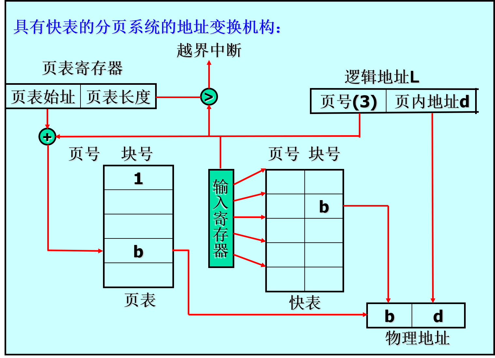

执行过程：先在快表中进行查询，找不到在去页表中进行查询。

### 4.5.3 访问内存的有效时间

### 4.5.4 两级和多级页表

**1. 产生的原因：**

>  问题：一个具有32位逻辑地址空间的分页系统，规定页面大小为4KB即212B，则每个进程页表的页表项可达1M个，若每个页表项占用一个字节，则每个进程的页表就要占据1MB的内存空间，而且要求连续存放。由于页表过大，在内存中很难找到一块连续的足够大小的内存空间。

解决方法：

1. 采用离散的方式
2. 只将当前所需页表项调入内存

**2. 两级页表**

​	将页表分页，并离散地将各个页面分别存放在不同的物理块中，同时为离散分配的页表在建立一张页表，称为外层页表，其每个页表项记录了页表页面的物理块号。

> 例子：
>
> ​	32位逻辑地址空间，页面大小为4KB(即12位)，若采用一级页表机构，应有20位页号，即页表项应有1M个；在采用两级页表机构时，再对页表进行分页，使每页包含210(即1024)个页表项，最多允许有210个页表分页。即

示意图：

**分页结构：**

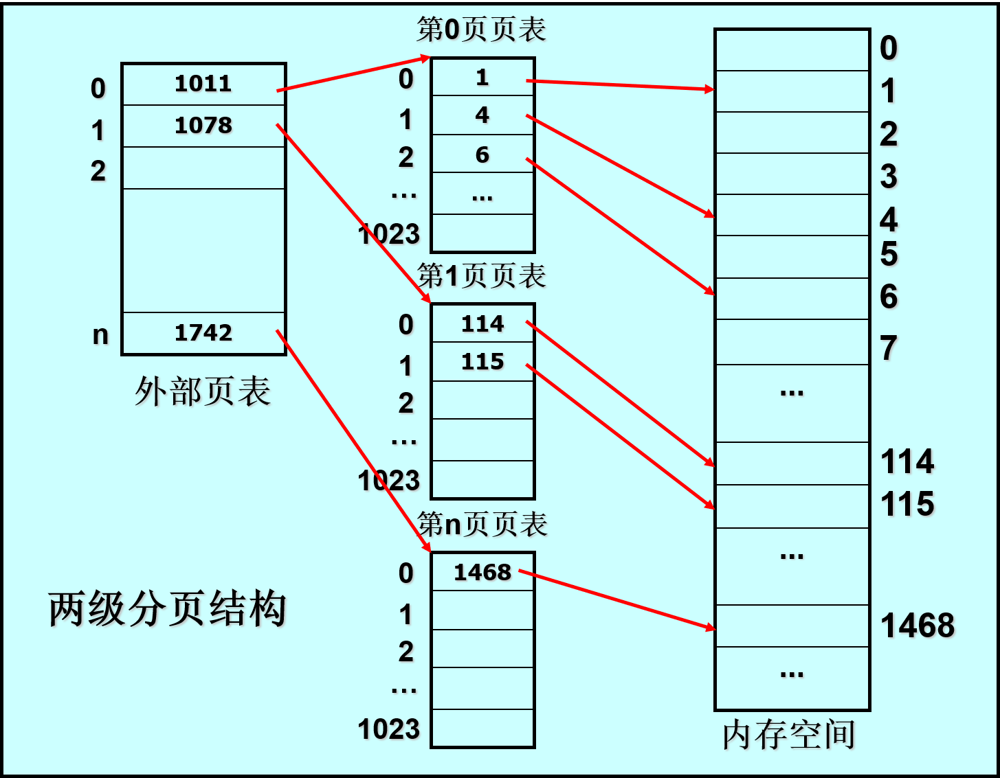

**两级页表的地址变换机构**

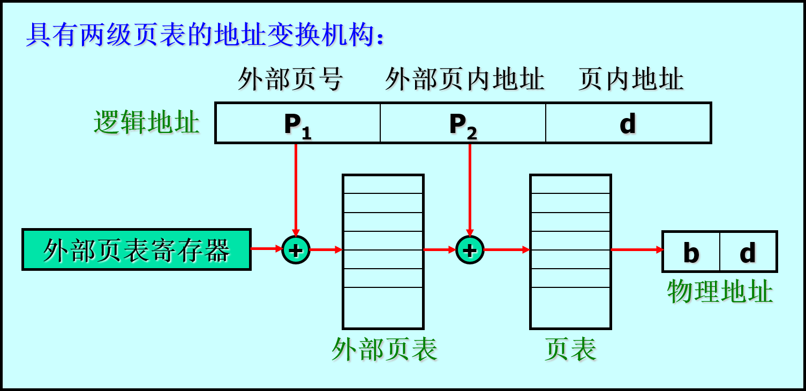

**两级页表的原理**

使用离散分配空间解决了大页表无需大片存储空间的问题，但并未减少页表所占的内存空间。

**多级页表的原理**

参照两级页表，对低一级的页表进行离散存储。

**计算题（重点）**

参照PPT

## 4.6 分段存储管理方式

### 4.6.1 分段存储管理方式的引入

**原因：**主要是为了满足用户在编程和使用上的多方面要求。

**优点：**

* 便于编程:

​        用户常把自己的作业按逻辑关系划分成若干个段，每段都有自己的名字，且都从零开始编址，这样，用户程序在执行中可用段名和段内地址进行访问。  例如：LOAD 1，[A] | <D> 。

* 分段共享:

​       在实现程序和数据的共享时，常常以信息的逻辑单位为基础，而分页系统中的每一页只是存放信息的物理单位，其本身没有完整的意义，因而不便于实现信息的共享，而段却是信息的逻辑单位，有利于信息的共享。

* 分段保护: 信息保护是对相对完整意义的逻辑单位(段)进行保护。

* 动态链接:当运行过程中又需要调用某段时，再将该段（目标程序）调入内存并链接起来。所以，动态链接是以段为基础的。

* 动态增长:

​       在实际系统中，有些数据段会不断地增长，而事先却无法知道数据段会增长到多大，分段存储管理方式能较好地解决这个问题。

### 4.6.2 分段系统的基本原理

**1. 分段**

​	在分段存储管理方式中，作业地址空间被划分为若干个段，每个段定义了一组逻辑信息，都有自己的名字。通常用段号代替段名，每段从0开始编址，并采用一段连续地址空间。段长由逻辑信息组的长度决定。整个作业的地址空间分成多个段，逻辑地址由段号(段名)和段内地址所组成。

示意图：

**2. 分段式存储的管理**

每段分配一个连续的内存区，各段的大小不要求相等，段间不要求连续。

**3. 分类**

* 基本分段
* 请求分段

**4. 段表**

由于各程序段离散的分配在内存中，所以需要建立一张段映射表。即段表。

段表的结构：段号，基址，段长

作用：实现从逻辑段到物理内存区的映射。

示意图：

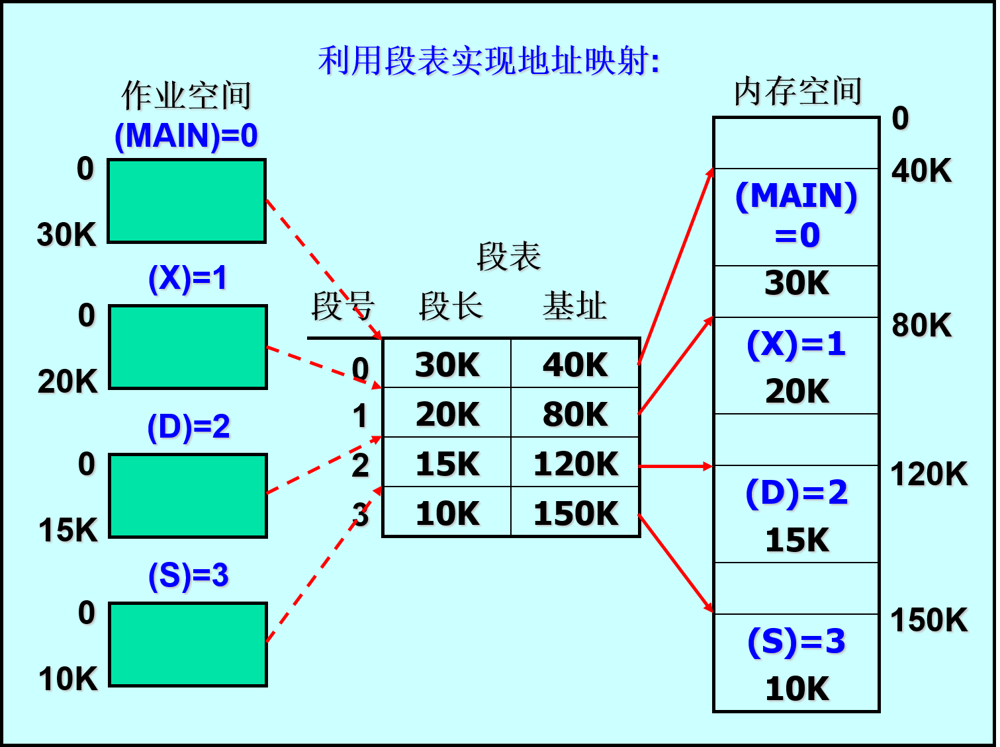

**5. 地址变换机构**

在系统中设置段表寄存器，用于存放段表始址和段表长度，以实现从进程的逻辑地址到物理地址的变换。

**6. 存在的问题及解决办法**

当段表存放在内存中时，每访问一个数据，都需访问两次内存，降低了计算机的速率。

解决方法：设置联想寄存器，用于保存最近常用的段表项。

**7. 分段式地址变换示意图**

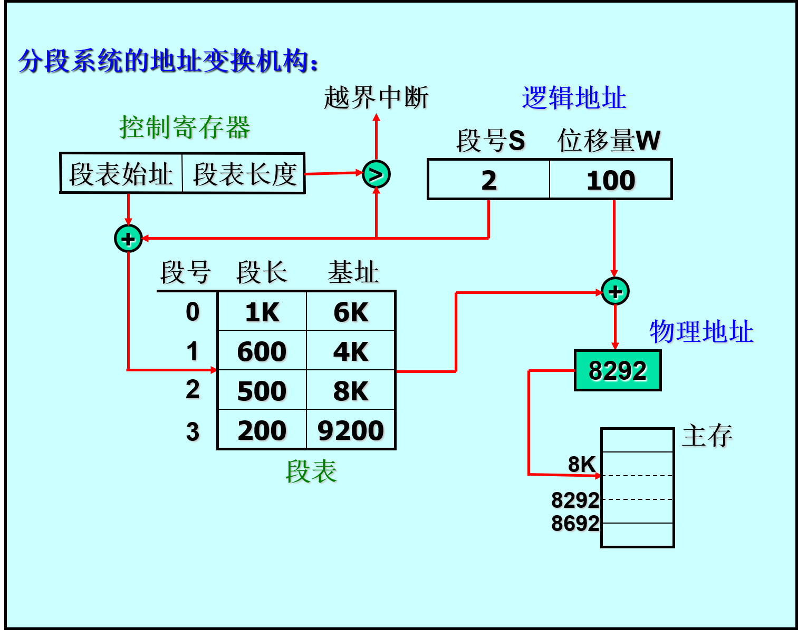

**8. 分段和分页的主要区别**

**相似点：**

采用离散分配方式，通过地址映射机构实现地址变换

**不同点：**

* 页是信息的物理单位，分页是为了满足系统的需要；段是信息的逻辑单位，含有一组意义相对完整的信息，分段是为了满足用户的需要。

* 页的大小固定且由系统确定，由系统把逻辑地址分为页号和页内地址，由机器硬件实现；段的长度不固定，取决于用户程序，编译程序对源程序编译时根据信息的性质划分。

* 分页的作业地址空间是一维的；分段的作业地址空间是二维的。