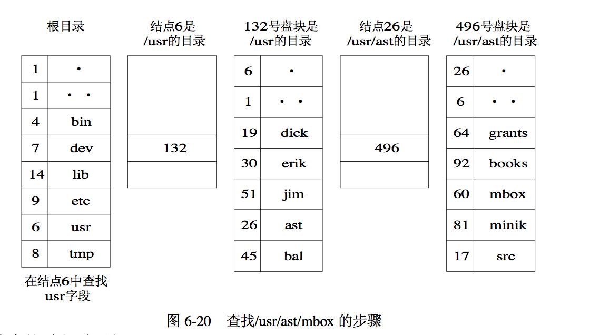

# 第七章 文件管理

## 7.3 文件目录

**1. 对文件管理的要求**

* 实现“按名存取”。
* 提高对目录的检索速度。
* 文件共享。
* 允许文件重名。

**2. 文件目录的定义**：文件控制块（FCB）的有序集合。

### 7.3.1 文件控制块和索引节点

**2. 索引节点**

**引入的原因：**

不使用索引结点时，查找某个文件的时候需要将文件目录中的文件的所有信息全部调入内存，因此文件目录可能需要占用大量的盘块，在查找一个文件的过程中可能会造成磁盘块频繁的换入和换出，大大增加系统的开销。但实际上查找文件只需要使用文件名即可。因此引入索引节点（包含某个文件的详细信息），而文件目录项仅包含文件名和该文件对应索引结点的编号，从而可减少磁盘块的换入和换出的频率。

### 7.3.2 简单的文件目录

**1. 单级文件目录**

> 最简单的目录结构。整个文件系统中只建立一张目录表，每个文件一个目录项，目录项含有文件相关信息。状态位表明每个目录项是否空闲。

**示意图：**

**优点：**

实现简单

**缺点：**

* 查找速度慢。

* 不允许重名。名字过多难于记忆。多用户环境下重名难以避免。

* 不便于实现文件共享。只适用于单用户环境。

**2. 两级文件目录**

> 设计了两级文件目录，一级是文件主目录，另一级是子目录

**优点：**

* 提高了检索目录的速度。

* 在不同的目录中可以有相同的文件名。

* 不同用户还可以使用不同的文件名来访问系统中的同一个共享文件。

**缺点：**

* 各用户之间被完全隔离了，无法进行合作。

### 7.3.3 树形结构目录

**优点：**

提高目录的检索速度和文件系统的性能（灵活性）。

### 7.3.4 目录查询技术

**1. 基本原理**

> 当用户要访问一个已存文件时，系统首先利用用户提供的文件名对目录进行查询，找出该文件控制块或对应索引结点；然后根据FCB或索引结点中所记录的文件物理地址，换算出文件在磁盘上的物理位置；最后通过磁盘驱动程序，将所需文件读入内存。目前对目录进行查询的方式有两种：线性检索法和Hash方法。

**2. 线性检索法**

**小例子：**

> 查找/usr/ast/mbox 的步骤：
>
> - 首先，系统应先读入第一个文件分量名 usr，用它与根目录文件(或当前目录文件)中各 目录项中的文件名顺序地进行比较，从中找出匹配者，并得到匹配项的索引结点号 6，再从 6 号索引结点中得知 usr 目录文件放在 132 号盘块中，将该盘块内容读入内存。
>
> - 接着，系统再将路径名中的第二个文件分量名 ast 读入，用它与放在 132 号盘块中的第二 级目录文件中各目录项的文件名顺序进行比较，又找到匹配项，从中得到 ast 的目录文件放在 26 号索引结点中，再从 26 号索引结点中得知/usr/ast 是存放在 496 号盘块中，再读入 496 号盘块。
>
> - 然后，系统又将该文件的第三个分量名 mbox 读入，用它与第三级目录文件/usr/ast 中各 目录项中的文件名进行比较，最后得到/usr/ast/mbox 的索引结点号为 60，即在 60 号索引结 点中存放了指定文件的物理地址。目录查询操作到此结束。如果在顺序查找过程中发现有 一个文件分量名未能找到，则应停止查找，并返回“文件未找到”信息。

**3. Hash方法**