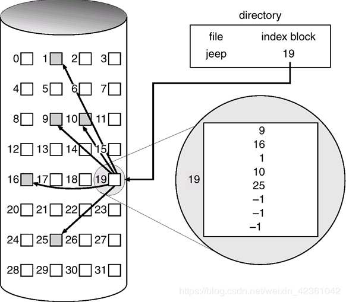
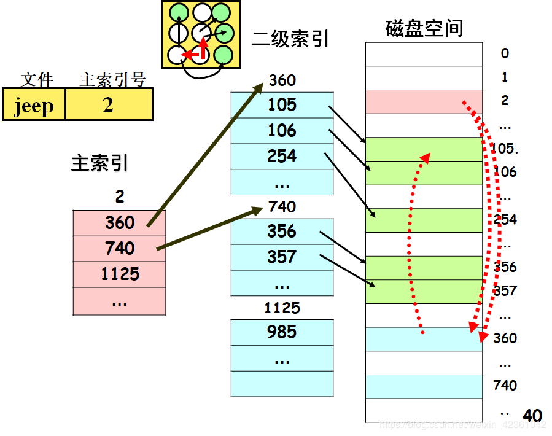

# 第八章 磁盘存储器的管理

## 8.1 外存的组织方式

**1. 连续组织方式**

> 连续分配要求为每一个文件分配一组相邻的盘块。在采用该方式时，可把逻辑文件中的记录顺序的存储到邻接的各物理块中，这样所形成的文件结构成为顺序文件结构，此时的物理文件称为顺序文件。这种分配方式保证了逻辑文件中的记录顺序与存储器中文件占用盘块的顺序的一致性。

**目录的结构**

| file（文件名） | start（起始位置） | length（长度） |
| -------------- | ----------------- | -------------- |
| file1          | 0                 | 10             |

**优点：**

* 顺序访问容易
* 顺序访问速度快（磁头移动的距离小）

**缺点：**

* 要求为每一个文件分配连续的存储空间，严重降低了外存空间的利用率
* 必须实现知道文件的长度
* 不能灵活的插入和删除记录
* 对于动态增长的文件，无法知道文件最终的大小

**2. 链接组织方式** 

**分类**

隐式链接分配方式：链接指针隐式地存放在盘块中

显示链接分配方式：增加FAT（File Allocation Table），将每一个文件的起始盘块号放在FCB（File Control Block）中。根据起始盘块号，依次在FAT中找出当前文件的盘块号。

**优点：**

* 由于链式分配是采取离散分配方式，消除了外部碎片；

* 因为是根据文件的当前需要，为它分配必须的盘块，当文件动态增长时，可动态的再为它分配盘块，故而无需事先知道文件的大小。

* 对文件的增、删、改也十分方便。

**缺点：**

* 不能支持高效的直接存取
* FAT也需要占用很大的空间

**3. 索引组织方式**

**单级索引方式**

> 适用情况：适合于大文件，对于中小型的文件直接使用链接方式即可。

原理图：

**多级索引方式**

> 将索引盘块同样使用索引进行组织。

原理图：

**混合索引方式**

第一种描述方式：

* 直接地址（保存的是目标的盘快号）
* 一级间址（保存直接地址所在盘块地址）
* 二级间址（保存一级间址所在盘块地址）

第二种描述方式：

* 第一级索引
* 第二级索引
* . . . 