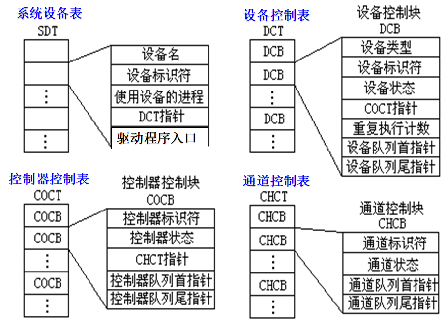

# 第六章 输入输出系统

## 6.4设备驱动程序

### 6.4.1 基本概念

设备处理程序通常又称为设备驱动程序，它是I/O系统的高层与设备控制器之间的通信程序。

由于驱动程序与硬件密切相关，故通常应为每一类设备配置一种驱动程序。比如打印机和显示器需要不同的驱动程序。

### 6.4.3 对I/O设备的控制方式

**始终坚持的一条宗旨：**尽量减少主机对I/O控制的干预，把主机从繁杂的I/O控制事务中解脱出来，以便更多的去完成数据处理任务。

四种控制方式的具体细节见P209

## 6.5 与设备无关的I/O软件

### 6.5.3 设备分配

**1.设备分配中设计的数据结构**

> **分配设备:** 根据物理设备名在SDT中找出该设备的DCT，若设备忙，便将请求I/O的进程PCB挂在设备队列上；否则，便按照一定的算法来计算本次设备分配的安全性，若不会导致系统进入不安全状态，便将设备分配给请求进程；否则，仍将其PCB插入设备队列。
>
> **分配控制器:** 分配设备给进程后，再到其DCT中找出与该设备连接的控制器的COCT。若控制器忙，便将请求I/O进程的PCB挂在该控制器的等待队列上；否则，将该控制器分配给进程。
>
> **分配通道:** 分配控制器后，再在COCT中找到与该控制器连接的CHCT。若通道忙，便将请求I/O的进程挂在该通道的等待队列上；否则，将该通道分配给进程。
>
> **注：**只有在设备、控制器和通道三者都分配成功时，这次的设备分配才算成功；之后便可启动该I/O设备进行数据传送。

**2. 改进的设备分配程序**

将上边的使用物理名改为使用逻辑名。